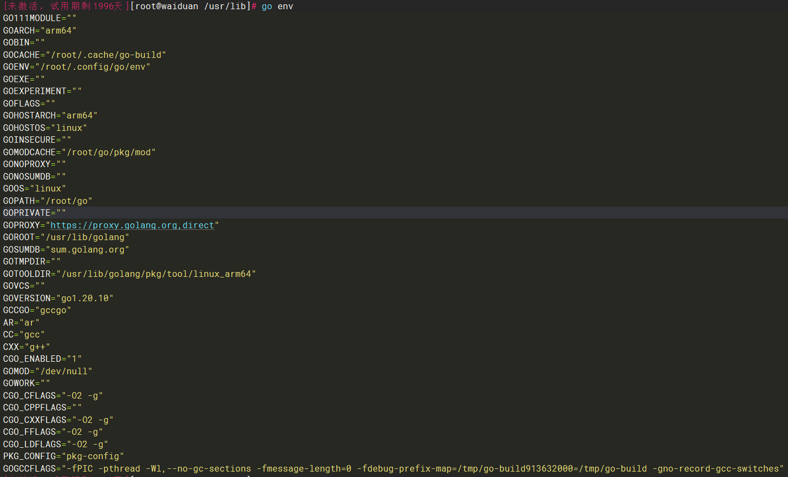

# Golang基础环境安装
## 申威平台 UOS 离线安装
1. 从sw官方下载golang 编译后的安装包
```shell
https://developer.wxiat.com/#/ecology/basicSoftware
```

2. 解压到安装位置, 进入对应目录xxx/bin/ 执行 ./go version 可以成功看到版本号
```shell
tar -xvf xxx.tar -C /home/
```

3. 配置环境变量 
进入 ~/.bashrc文件增加环境变量 增加如下一行
```shell
export PATH=$PATH:/home/xxx/bin
```
4. 刷新bashrc文件 
```shell
source ~/.bashrc
```
5. 任意位置 执行 `go version` 均可以打印出版本信息
6. 设置国内源 `GO111MODULE` 开启后将会使用查找依赖包的方法(go.mod), 而不是在GOPATH下查找,代码文件也可以放在任何目录下(建议1.16版本以上设置)
```shell
echo "export GO111MODULE=on" >> ~/.profile
echo "export GOPROXY=https://goproxy.cn" >> ~/.profile
source ~/.profile
```
---

## ARM平台 ky10 离线安装
1. 从sw官方下载golang 编译后的安装包
```shell
https://golang.google.cn/dl/
```

2. 解压到安装位置, 进入对应目录xxx/bin/ 执行 ./go version 可以成功看到版本号
```shell
tar -xvf xxx.tar -C /home/
```

3. 配置环境变量 
进入 ~/.bashrc文件增加环境变量 增加如下一行
```shell
export PATH=$PATH:/home/xxx/bin
```
4. 刷新bashrc文件 
```shell
source ~/.bashrc
```
5. 任意位置 执行 `go version` 均可以打印出版本信息
6. 设置国内源 `GO111MODULE` 开启后将会使用查找依赖包的方法(go.mod), 而不是在GOPATH下查找,代码文件也可以放在任何目录下(建议1.16版本以上设置)
```shell
echo "export GO111MODULE=on" >> ~/.profile
echo "export GOPROXY=https://goproxy.cn" >> ~/.profile
source ~/.profile
```
---

## 升级golang版本

1. 使用命令查看golang环境版本信息，可以查看到golang安装包位置`GOROOT`, 可以看到位置在`/usr/lib/golang`
```shell
    go env
```

2. 进入`/usr/lib/golang` 将该`golang`文件夹改名为对应版本
```shell
    mv golang golang-15.7
```
3. 下载对应架构的`golang`安装包
4. 解压到`/usr/lib`处，默认解压完是`go`文件夹，然后改名为`golang`
5. 执行`go version` 可以看到最新版本 