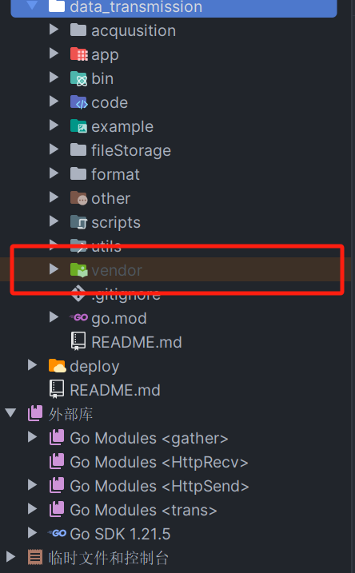

# Go Package

## 迁移、备份包到其他环境

位置：`/root/go/pkg`


## 区分包和独立应用程序

独立应用程序使用 main 包。 包（库）使用不同的名称<br/>
main 包指示程序将生成独立的可执行程序

## 使用go.mod 管理依赖

1. 初始化模块

`go mod init example.com/module_name`

2.  更新依赖管理文件go.mod

`go mod tidy`

3. 更新所有依赖

`go get -u ./...` 

4. 更新到指定版本

`go get github.com/example/package@v1.2.3`

## 发布Package

1. 在github创建仓库，权限选择默认，仓库名可以设置为包名
2. 拉取仓库并初始化

```go
go mod init github.com/Aliuyanfeng/testpackage

```

3. 编写代码`test.go`

```go
package testpackage

// Hello returns a greeting.
func Hello() string {
	return "Hello Everyone !"
}

// Glass returns a useful phrase for world travelers.
func Glass() string {
	// See http://www.oocities.org/nodotus/hbglass.html.
	return "I can eat glass and it doesn't hurt me."
}

// Go returns a Go proverb.
func Go() string {
	return "Don't communicate by sharing memory, share memory by communicating."
}

// Opt returns an optimization truth.
func Opt() string {
	// Wisdom from ken.
	return "If a program is too slow, it must have a loop."
}

```

4. 推送代码  打tag版本 用于管理被引入的版本

```go
git tag -a v0.1.0 -m "publish package"
git push origin v0.1.0
```

5. 引入和使用包.

`import github.com/Aliuyanfeng/testpackage`

## 离线依赖
离线场景下开发编译, 执行命令可在项目根目录生成`vendor`目录，如果本地存在了vendor，在 go build 编译时优先级最高会在该目录找依赖库，其次是在 mod cache在找依赖库.<br/>
执行命令`go mod vendor`，可在项目根目录下看到生成的`vendor`目录
