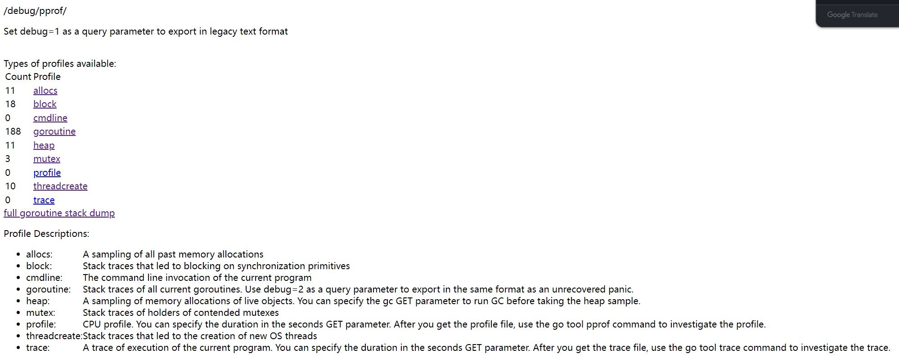
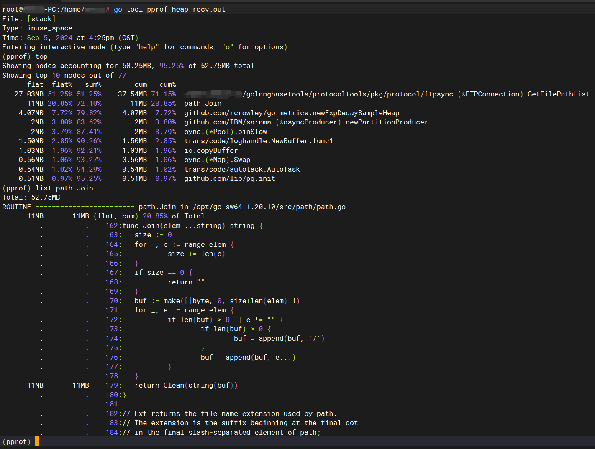
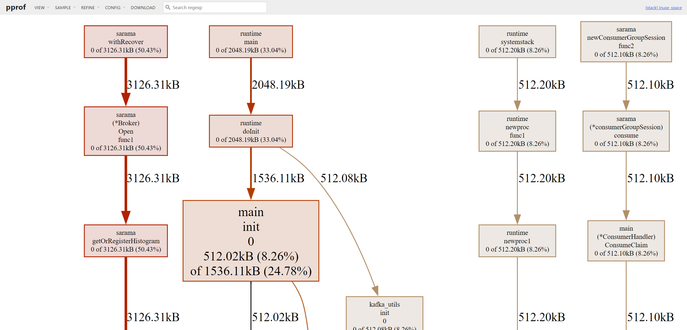

# 性能分析工具-pprof

## 使用方式
1. 基于 HTTP Server 运行，并且可以采集运行时数据进行分析
2. 通过运行测试用例，并指定所需标识来进行采集
3. runtime/pprof：采集程序（非 Server）的指定区块的运行数据进行分析

比较常用的是用`net/http/pprof`包，可以在程序运行时采集数据，以下分析均基于`net/http/pprof`

## 采集数据
在程序中引入依赖,并启动一个HTTP Server  
```go
import (
    "net/http"
    _ "net/http/pprof"
)

func main() {

    // 业务代码...
    doSomething()

	// 监听 查看 运行情况 访问: http://localhost:8103/debug/pprof/
    err = http.ListenAndServe("0.0.0.0:8103", nil)
    if err != nil {
        log.Error("监听失败", zap.Error(err))
    }
}
```
通过浏览器访问`http://localhost:8103/debug/pprof/`，你会进入下面这个页面  

图中可点击的属性，分别代表：  
- `allocs`:对所有过去的内存分配进行采样(历史累加)
- `block`:导致同步原语阻塞的栈跟踪(历史累加)
- `cmdline`:当前程序的命令行调用
- `goroutine`:所有当前goroutine的堆栈跟踪。使用debug=2作为查询参数，以与未恢复的panic相同的格式导出。
- `heap`:活动对象的内存分配抽样。您可以在获取堆示例之前指定gc GET参数来运行gc。
- `mutex`:查看导致互斥锁的竞争持有者的堆栈跟踪（历史累加）
- `profile`:CPU配置文件。你可以在seconds GET参数中指定持续时间。获取配置文件后，使用go tool pprof命令来研究该配置文件。
- `threadcreate`:创建新操作系统线程的栈跟踪
- `trace`:当前程序执行的跟踪。你可以在seconds GET参数中指定持续时间。在您获得跟踪文件之后，使用go工具trace命令来调查跟踪。

⚠️**Tips**:默认情况下是不追踪`block`和`mutex`的信息的，如果想要看这两个信息，需要在代码中加上两行：  
```go
runtime.SetBlockProfileRate(1) // 开启对阻塞操作的跟踪，block  
runtime.SetMutexProfileFraction(1) // 开启对锁调用的跟踪，mutex
```
### 方式

为了进一步的分析数据，单单依靠这个网页是行不通的，这里采用了较为复杂的方法，但是通用性强：  
- 执行命令`curl -o heap.out http://localhost:8103/debug/pprof/heap`将分析数据存储到文件中
- 通过`go tool pprof heap.out` 可对分析文件进行详细的查看
  
- 也可以将分析文件拷贝到自己的Windows电脑上通过`go tool pprof -http=:1234 heap.out` 调起浏览器进行可视化的信息查看，（需安装图形工具[graphviz](http://www.graphviz.org/download/)）
  


## 分析数据
针对采集好的数据，我们有