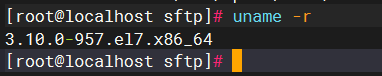
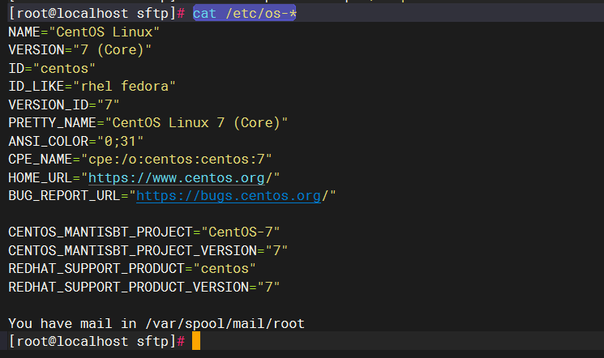

Linux常用命令大全

[Linux命令大全(手册) – 真正好用的Linux命令在线查询网站](https://www.linuxcool.com/)

## 分类

### Redhat系

+ RHEL
+ Centos
  - 软件包管理器 yum
    * yum -y update 升级所有包同时也升级软件和系统内核
    * yum -y upgrade 只升级所有包，不升级软件和系统内核

### Debian系

+ Debian
+ Ubuntu
  - 软件包管理器 apt

依赖下载 不安装

`apt-get install -d qemu-utils`

存储位置

`/var/cache/apt/archives`

离线安装依赖

`dkpg -i packagename`

## 网络

查看网关 Gateway

`netstat -rn`

查看dns

`cat /etc/resolv.conf`

## vim

###### 复制当前光标到行末的内容

```plain
命令行模式下输入 y$
```

###### 粘贴内容到指定位置

```plain
命令行模式下输入 p
```

###### 删除文件中所有内容

```plain
1. 命令行模式下输入 ggdG   
gg代表光标移动到文本首行 
dG代表删除当前光标所在行到末尾行的全部内容
d删除
G跳转到文件末尾行
2. 命令行模式下输入 :1,$d
1,$表示选择从第一行到最后一行的内容
d删除
```

###### 撤销与反撤销

```plain
撤销：命令行模式下小写字母 u
反撤销：命令行模式下 ctrl + r
```

###### 设置隐藏/显示行号

```plain
命令行模式下输入 :set nu  显示行号
命令行模式下输入 :set nonu  隐藏行号
```

######  批量替换内容

```powershell
## 替换单个实例 这会将当前行中第一个匹配old_pattern的实例替换为new_pattern。
:s/old_pattern/new_pattern/

## 替换整个文件中的每个实例： 使用%表示对整个文件进行替换，而g标志表示替换每个匹配项而不仅仅是每行的第一个。
:%s/old_pattern/new_pattern/g

## 在命令后面加上i标志，表示大小写不敏感
:%s/old_pattern/new_pattern/gi

```

###### 移到末尾/头部

```plain
(刚进入的模式,esc模式)先 G 或 shift+g 到最后一行

gg           ： 跳转到文件头

Shift+g   ： 跳转到文件末尾

行数+gg ： 跳转到指定行，例跳转到123行：123gg

1.跳转到文件头

输入冒号(:)，打开命令输入框

输入命令1，是“一”的阿拉伯数字，不是小写的L


2.跳转到文件尾

输入冒号(:)，打开命令输入框

输入命令：$
```

## 文件、目录

### 创建文件

`touch myfile.py`

### 读取文件内容

`cat myfile.py`

### 写入内容到文件

`echo "Hello World" > filename.txt`

### 创建文件夹

`mkdir filefolder`

### 删除文件夹

rm -rfv myfolder

### 复制

###### 复制指定数量文件

`ls |head -n 10000 |xargs -i cp {} /tmp`  复制前一万个文件到 tmp 下

###### 将宿主机内容拷贝到容器：

`docker cp /data/test hlqx-web-server:/data/` 将主机/data/test目录拷贝到容器hlqx-web-server的/data目录下。

###### 将容器内容拷贝到宿主机

`docker cp  hlqx-web-server:/data/test /tmp/` 将容器的/data/test目录拷贝到主机的/tmp目录下

###### 两个服务器之间复制文件

`scp -r root@10.253.14.2:/data/swj/CC/samples_format/Document /data/test_document/ ` 复制14.2服务器上的/data/swj/CC/samples_format/Document文件夹至本服务器/data/test_document/内

### 复制文件到指定目录

cp filename.txt /home/antiy/


### 清空文件夹下所有文件

```plain
rm -rf /path/to/folder/*
```

## 查看目录中最大的文件

`du -sh --max-depth=0 ./*`

### 查看目录中各个文件大小

`ls -al -h`

`du -sh ./*`


## 快速清空文件

常用的清空linux文件的三种方式：

1）.使用vi/vim命令打开文件后，输入"%d"清空，后保存即可。但当文件内容较大时，处理较慢，命令如下：vim file_name:%d:wq

2）.使用cat命令情况，命令如下：cat /dev/null > file_name

3）.使用echo命令清空，此时会在文件中写入一个空行“\n"，命令如下：echo "">file_name推荐使用cat命令。

## 设置linux时间

### 手动设置

`date -s "2022-02-21 19:41:28"`

### 联网设置

待补充

## 压缩日志文件log.gz直接查看

直接用zcat就可以查看

zgrep就可以直接查找

## 压缩/解压缩


### .tar

只打包，不压缩文件

解包  `tar -xvf filename.tar`

打包  `tar -cvf filename.tar filename`

-c 建立新的备份文件

-x 从备份文件中还原文件

-v 显示指令执行过程

-f 指定备份文件

### .gz

只压缩，不打包文件

解压：`gunzip  Name.gz`

解压2：`gzip -d Name.gz`

压缩：`gzip Name`

### .tar.gz

打包压缩文件

解包：  `tar -zxvf Name.tar.gz`

打包：`tar -zcvf Name.tar.gz  dirName`

-z 通过gzip指令处理备份文件

### 使用tar把一个文件夹分包压缩

打包为tar文件

`tar -cvf filename.tar filename/`

使用split分包压缩 -b 单包大小 单位MB -d part包后缀为数组

`split -b 1000M -d filename.tar filename.part`

解压缩时 把所有分包放到同一目录 ，解压到当前目录

`cat filename.part*| tar -xvf -`

### 

## 系统

查看当前的内核版本

`uname -r`  

`cat /etc/os-*`



## CURL

1. 发送GET请求

`curl URL?a=1&b=nihao`

2. 发送POST请求携带JSON格式数据

`curl -H "Content-Type: application/json" -X POST -d '{"abc":123,"bcd":"nihao"}' URL`


-H代表header头，

-X是指定什么类型请求(POST/GET/HEAD/DELETE/PUT/PATCH)，

-d代表传输什么数据


## 格式

### 将DOS格式[文本文件](https://so.csdn.net/so/search?q=%E6%96%87%E6%9C%AC%E6%96%87%E4%BB%B6&spm=1001.2101.3001.7020)转换成Unix格式

转换当前目录下所有文件

`find -type f | xargs dos2unix`


## 用户
列出用户的主目录
`echo ~username`  


## 时间校准

### 手动  
`date -s "2022-10-01 12:00:00"`  
### ntp