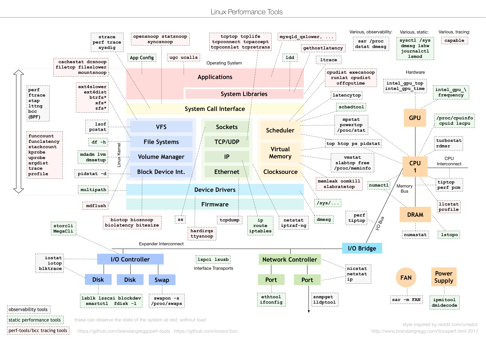
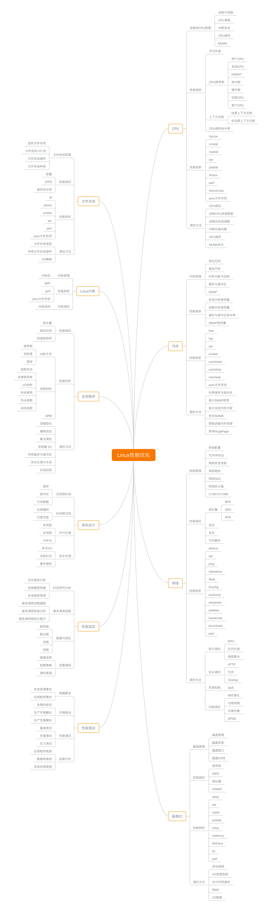

# Linux系统性能优化

## Linux 性能工具图谱
通过这张图谱，在 Linux 不同子系统出现性能问题后，可以查到应该用什么样的工具来观测和分析，比如，当遇到 I/O 性能问题时，可以参考图片最下方的 I/O 子系统，使用 iostat、iotop、blktrace 等工具分析磁盘 I/O 的瓶颈。    

## Linux 性能优化思维导图

- 💡本章节内容摘选倪朋飞老师的【Linux性能优化实战】专栏