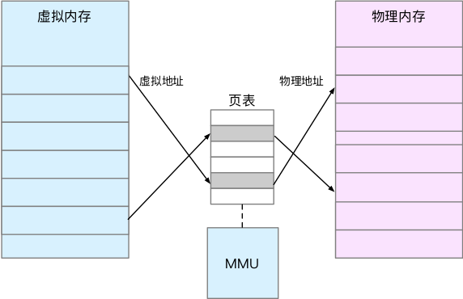
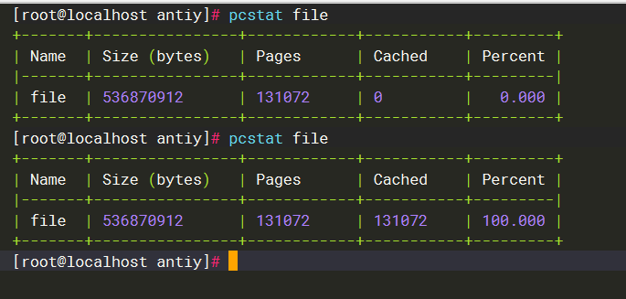
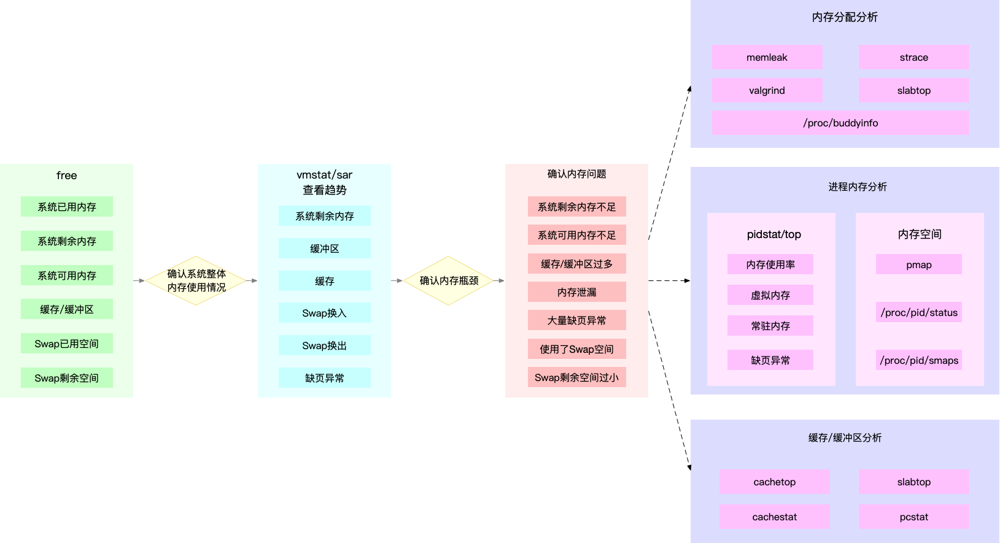

# 内存性能

## 内存映射
Linux 内核给每个进程都提供了一个独立的虚拟地址空间，并且这个地址空间是连续的。这样，进程就可以很方便地访问内存，更确切地说是访问虚拟内存。虚拟地址空间的内部又被分为内核空间和用户空间两部分，不同字长（也就是单个 CPU 指令可以处理数据的最大长度）的处理器，地址空间的范围也不同。比如最常见的 32 位和 64 位系统：  

通过这里可以看出，32 位系统的内核空间占用 1G，位于最高处，剩下的 3G 是用户空间。而 64 位系统的内核空间和用户空间都是 128T，分别占据整个内存空间的最高和最低处，剩下的中间部分是未定义的。

进程可以在用户态和内核态间切换，进程在用户态时，只能访问用户空间内存；只有进入内核态后，才可以访问内核空间内存。虽然每个进程的地址空间都包含了内核空间，但这些内核空间，其实关联的都是相同的物理内存。这样，进程切换到内核态后，就可以很方便地访问内核空间内存。

既然每个进程都有一个这么大的地址空间，那么所有进程的虚拟内存加起来，自然要比实际的物理内存大得多。所以，并不是所有的虚拟内存都会分配物理内存，只有那些实际使用的虚拟内存才分配物理内存，并且分配后的物理内存，是通过内存映射来管理的。

内存映射，其实就是将虚拟内存地址映射到物理内存地址。为了完成内存映射，内核为每个进程都维护了一张页表，记录虚拟地址与物理地址的映射关系，如下图所示：



Buffers 是对原始磁盘块的临时存储，也就是用来缓存磁盘的数据，通常不会特别大（20MB 左右）。这样，内核就可以把分散的写集中起来，统一优化磁盘的写入，比如可以把多次小的写合并成单次大的写等等。

Cached 是从磁盘读取文件的页缓存，也就是用来缓存从文件读取的数据。这样，下次访问这些文件数据时，就可以直接从内存中快速获取，而不需要再次访问缓慢的磁盘。

SReclaimable 是 Slab 的一部分。Slab 包括两部分，其中的可回收部分，用 SReclaimable 记录；而不可回收部分，用 SUnreclaim 记录。


Buffer 既可以用作“将要写入磁盘数据的缓存”，也可以用作“从磁盘读取数据的缓存”。

Cache 既可以用作“从文件读取数据的页缓存”，也可以用作“写文件的页缓存”。

简单来说，Buffer 是对磁盘数据的缓存，而 Cache 是文件数据的缓存，它们既会用在读请求中，也会用在写请求中。

## 内存的分配和回收
程序中定义了一个局部变量，比如一个整数数组 int data[64] ，就定义了一个可以存储 64 个整数的内存段。由于这是一个局部变量，它会从内存空间的栈中分配内存，栈内存由系统自动分配和管理。一旦程序运行超出了这个局部变量的作用域，栈内存就会被系统自动回收，所以不会产生内存泄漏的问题。


## Buffer 和 Cache 在不同场景下的使用情况。

### 1. 磁盘文件系统
#### 测试Cache缓存文件对文件读取的影响

1. 使用 dd 命令生成一个临时文件，用于后面的文件读取测试 
``` shell
# 生成一个 512MB 的临时文件
dd if=/dev/sda1 of=file bs=1M count=1024
# 清理缓存
echo 3 > /proc/sys/vm/drop_caches
```
2. 使用pcstat命令，确认刚刚生成的文件不在缓存中

3. 新开一个终端，通过`cachetop` 命令 每5s观察一次缓存命中数据
```shell
# 每隔 5 秒刷新一次数据
cachetop 5
```
4. 新开一个终端，运行 dd 命令测试文件的读取速度，由于之前清空了缓存，从读取结果来看文件的读取速度为495MB/s, 当然这也受到硬盘本身素质和种类的影响。  
```shell
dd if=/home/antiy/file of=/dev/null bs=1M
```

5. 在另外一个终端种通过cachetop可以观察到命中情况

从 cachetop 的结果可以发现，并不是所有的读都落到了磁盘上，事实上读请求的缓存命中率只有 50% 。 这里读请求50%的缓存命中率解释为：**预读**，在许多操作系统中，文件系统会采用预读（read-ahead）策略来优化性能。预读是指在程序请求读取数据之前，系统会提前加载一部分数据到缓存中，以期望这些数据会被后续操作使用。
预读如何可能影响到缓存命中率的几个点：

- 预读操作：即使特定文件的数据没有被缓存，文件系统可能会执行预读操作，将数据加载到缓存中。如果这些预读的数据随后被访问，那么缓存命中率会增加。
- 预读命中率：预读的数据如果被应用程序读取，那么这些读取操作将会在缓存中命中，即使原始文件数据并未被缓存。这可能导致缓存命中率看起来比实际应该的更高。
- 预读算法：不同的文件系统有不同的预读算法，这些算法可能会根据文件访问模式来调整预读策略，从而影响缓存命中率。
6. 为了确认缓存对读取的性能影响，继续在终端执行相同的命令进行读取操作  


7. 继续观察cachetop的命中结果，可以看到经过缓存后，命中率已经100%

8. 通过`pcstat`命令观察该文件的缓存前后情况

可以观察到第一次执行读取命令，文件已经被缓存，第二次在读取的时候直接读取缓存，提高了速度。

### 2. 内存文件系统

#### 测试Cache文件对文件读取的影响


### 3. 内存性能指标
最容易想到的是系统内存使用情况，比如已用内存、剩余内存、共享内存、可用内存、缓存和缓冲区的用量等。

已用内存和剩余内存很容易理解，就是已经使用和还未使用的内存。

共享内存是通过 tmpfs 实现的，所以它的大小也就是 tmpfs 使用的内存大小。tmpfs 其实也是一种特殊的缓存。

可用内存是新进程可以使用的最大内存，它包括剩余内存和可回收缓存。

缓存包括两部分，一部分是磁盘读取文件的页缓存，用来缓存从磁盘读取的数据，可以加快以后再次访问的速度。另一部分，则是 Slab 分配器中的可回收内存。

缓冲区是对原始磁盘块的临时存储，用来缓存将要写入磁盘的数据。这样，内核就可以把分散的写集中起来，统一优化磁盘写入。

第二类很容易想到的，应该是进程内存使用情况，比如进程的虚拟内存、常驻内存、共享内存以及 Swap 内存等。

虚拟内存，包括了进程代码段、数据段、共享内存、已经申请的堆内存和已经换出的内存等。这里要注意，已经申请的内存，即使还没有分配物理内存，也算作虚拟内存。

常驻内存是进程实际使用的物理内存，不过，它不包括 Swap 和共享内存。

共享内存，既包括与其他进程共同使用的真实的共享内存，还包括了加载的动态链接库以及程序的代码段等。

Swap 内存，是指通过 Swap 换出到磁盘的内存。

当然，这些指标中，常驻内存一般会换算成占系统总内存的百分比，也就是进程的内存使用率。

除了这些很容易想到的指标外，我还想再强调一下，缺页异常。

在内存分配的原理中，我曾经讲到过，系统调用内存分配请求后，并不会立刻为其分配物理内存，而是在请求首次访问时，通过缺页异常来分配。缺页异常又分为下面两种场景。

可以直接从物理内存中分配时，被称为次缺页异常。

需要磁盘 I/O 介入（比如 Swap）时，被称为主缺页异常。

显然，主缺页异常升高，就意味着需要磁盘 I/O，那么内存访问也会慢很多。

除了系统内存和进程内存，第三类重要指标就是 Swap 的使用情况，比如 Swap 的已用空间、剩余空间、换入速度和换出速度等。

已用空间和剩余空间很好理解，就是字面上的意思，已经使用和没有使用的内存空间。

换入和换出速度，则表示每秒钟换入和换出内存的大小。


### 内存性能工具


