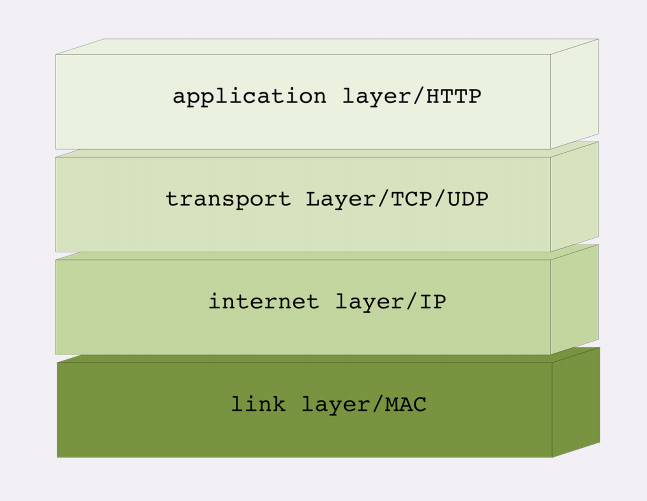
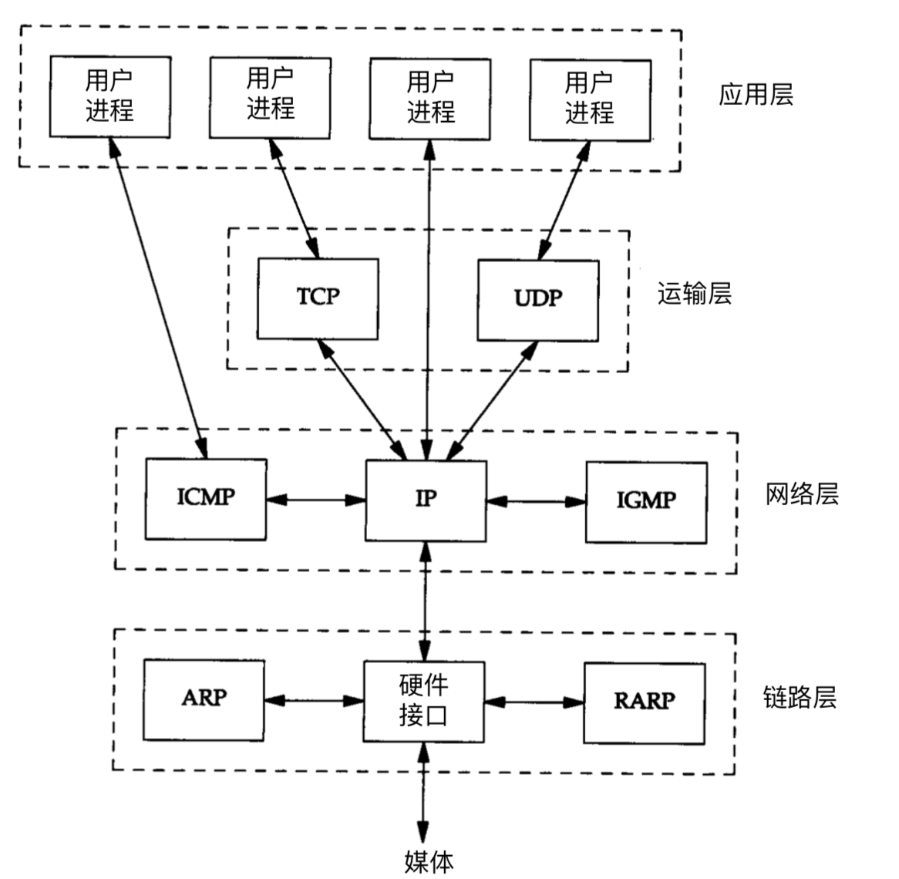

# TCP/IP四层模型介绍

TCP/IP协议是一系列网络协议的总和；包括：TCP，IP，UDP，ARP等，这些被称为子协议。在这些协议中，最重要、最著名的就是TCP和IP。因此，大部分网络管理员称整个协议族为“TCP/IP”它定义了电子设备如何接入互联网，以及数据如何在它们之间互相传输

IP 协议是“Internet Protocol”的缩写，主要目的是解决寻址和路由问题，以及如何在两 点间传送数据包。IP 协议使用“IP 地址”的概念来定位互联网上的每一台计算机。

​TCP 协议是“Transmission Control Protocol”的缩写，意思是“传输控制协议”，它位 于 IP 协议之上，基于 IP 协议提供可靠的、字节流形式的通信，是 HTTP 协议得以实现的基础。

​TCP/IP 协议总共有四层，就像搭积木一样，每一层需要下层的支撑，同时又支撑着上层，任何一层被抽掉都可能会导致整个协议栈坍塌。

从上到下分别四层

第一层：应用层：负责处理特定的应用程序细节，应用程序间沟通的层（HTTP）。

第二层：运输层：提供进程间的数据传输。在TCP/IP协议族中，有两个互不相同的传输协议：TCP(传输控制协议)和UDP(用户数据报协议)。

第三层：网络层：提供数据封包传送服务。在TCP/IP协议族中，网络层协议包括IP协议(网际协议)，ICMP协议(Internet互联网控制报文协议)，以及IGMP协议(Internet组管理协议)。

第四层：链路层：有时也称作数据链路层或网络接口层,通常包括操作系统中的设备驱动程序和计算机中对应的网络接口卡，负责数据帧的发送和接收。

TCP/IP协议簇

## 应用层

- 应用层的主要协议：
  - HTTP（Hypertext Transfer Protocol，超文本传输协议）
  - HTTP（HyperText Transfer Protocol Secure，超文本传输安全协议）
  - FTP（File Transfer Protocol，文件传输协议）
  - SMTP（Simple Mail Transfer Protocol，简单邮件传输协议）
  - DNS（Domain Name System，地址解析协议）
- 主要功能：
按照不同应用的特定要求和方式把数据传输到传输层或者接受从传输层返回的数据。实现不同应用之间的通信和数据交换，提供各种应用服务，如网页浏览、文件传输、电子邮件发送等。