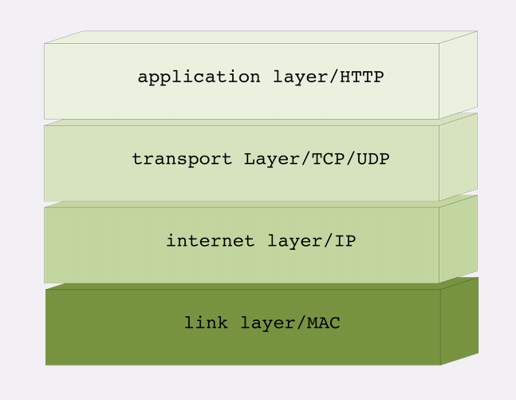
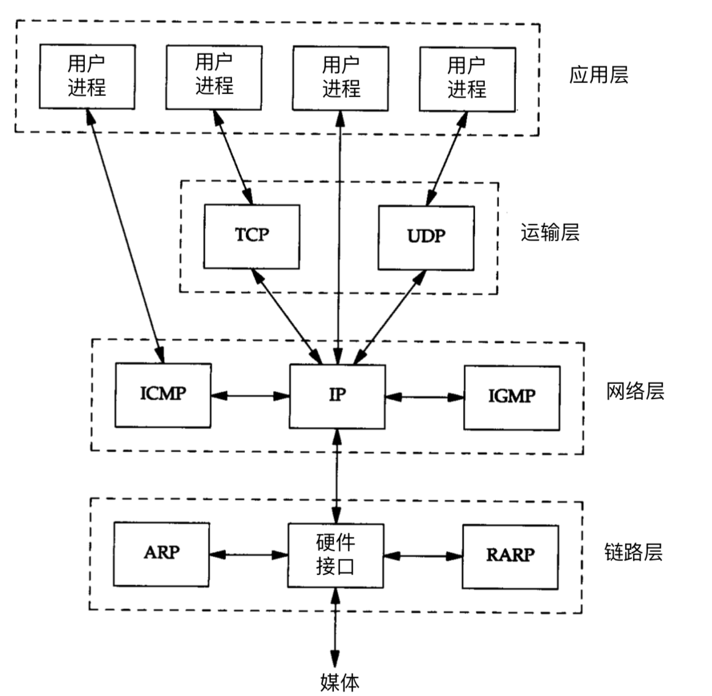

##  TCP/IP四层模型介绍

TCP/IP协议是一系列网络协议的总和；包括：TCP，IP，UDP，ARP等，这些被称为子协议。在这些协议中，最重要、最著名的就是TCP和IP。因此，大部分网络管理员称整个协议族为“TCP/IP”它定义了电子设备如何接入互联网，以及数据如何在它们之间互相传输

IP 协议是“Internet Protocol”的缩写，主要目的是解决寻址和路由问题，以及如何在两 点间传送数据包。IP 协议使用“IP 地址”的概念来定位互联网上的每一台计算机。

​TCP 协议是“Transmission Control Protocol”的缩写，意思是“传输控制协议”，它位 于 IP 协议之上，基于 IP 协议提供可靠的、字节流形式的通信，是 HTTP 协议得以实现的基础。

​TCP/IP 协议总共有四层，就像搭积木一样，每一层需要下层的支撑，同时又支撑着上层，任何一层被抽掉都可能会导致整个协议栈坍塌。

从上到下分别四层

第一层：应用层：负责处理特定的应用程序细节，应用程序间沟通的层（HTTP）。

第二层：运输层：提供进程间的数据传输。在TCP/IP协议族中，有两个互不相同的传输协议：TCP(传输控制协议)和UDP(用户数据报协议)。

第三层：网络层：提供数据封包传送服务。在TCP/IP协议族中，网络层协议包括IP协议(网际协议)，ICMP协议(Internet互联网控制报文协议)，以及IGMP协议(Internet组管理协议)。


第四层：链路层：有时也称作数据链路层或网络接口层,通常包括操作系统中的设备驱动程序和计算机中对应的网络接口卡，负责数据帧的发送和接收。



TCP/IP协议簇



### 应用层

- 应用层的主要协议：
  - HTTP（Hypertext Transfer Protocol，超文本传输协议）
  - HTTP（HyperText Transfer Protocol Secure，超文本传输安全协议）
  - FTP（File Transfer Protocol，文件传输协议）
  - SMTP（Simple Mail Transfer Protocol，简单邮件传输协议）
  - DNS（Domain Name System，地址解析协议）
- 主要功能：
按照不同应用的特定要求和方式把数据传输到传输层或者接受从传输层返回的数据。实现不同应用之间的通信和数据交换，提供各种应用服务，如网页浏览、文件传输、电子邮件发送等。

## TCP/IP OSI网络7层模型  

分别是应用层、表示层、会话层、传输层、网络层、数据链路层以及物理层。  

每一层负责的职能都不同，如下：
• 应用层，负责给应用程序提供统一的接口；
• 表示层，负责把数据转换成兼容另一个系统能识别的格式；
• 会话层，负责建立、管理和终止表示层实体之间的通信会话；
• 传输层，负责端到端的数据传输；
• 网络层，负责数据的路由、转发、分片；
• 数据链路层，负责数据的封帧和差错检测，以及 MAC 寻址；
• 物理层，负责在物理网络中传输数据帧；

## TCP 协议详解

### TCP 报文格式

TCP 报文由**首部**和**数据**两部分组成。首部的前 20 个字节是固定的，后面可以有 4N 字节的选项字段。

| 字段 | 长度 | 说明 |
|------|------|------|
| 源端口 | 16 位 | 发送方端口号 |
| 目的端口 | 16 位 | 接收方端口号 |
| 序号（Seq） | 32 位 | 本报文段所发送数据的第一个字节的序号 |
| 确认号（Ack） | 32 位 | 期望收到对方下一个报文段的第一个数据字节的序号 |
| 数据偏移 | 4 位 | TCP 首部长度（以 4 字节为单位） |
| 保留 | 6 位 | 保留字段 |
| 控制位 | 6 位 | URG、ACK、PSH、RST、SYN、FIN |
| 窗口大小 | 16 位 | 接收窗口大小，用于流量控制 |
| 检验和 | 16 位 | 校验首部和数据 |
| 紧急指针 | 16 位 | 仅在 URG=1 时有效 |

**6 个控制位说明：**
- **URG**：紧急指针有效
- **ACK**：确认号有效（连接建立后所有报文都必须置 1）
- **PSH**：提示接收方尽快将数据交付应用层
- **RST**：重置连接
- **SYN**：同步序号，用于建立连接
- **FIN**：发送方数据发送完毕，用于释放连接

### TCP 三次握手（建立连接）

TCP 建立连接的过程称为**三次握手**，目的是同步双方的初始序号（ISN），确保双方都有发送和接收数据的能力。

```
  客户端                                服务器
    |                                     |
    |  -------- SYN=1, Seq=x -------->    |  第一次握手：客户端发送 SYN 包
    |                                     |
    |  <--- SYN=1, ACK=1, Seq=y, ----     |  第二次握手：服务器回应 SYN+ACK
    |       Ack=x+1                    |
    |                                     |
    |  -------- ACK=1, Seq=x+1, ----->    |  第三次握手：客户端发送 ACK 确认
    |       Ack=y+1                       |
    |                                     |
    |  连接建立，开始数据传输              |
```

**为什么需要三次握手？**
- 防止已失效的连接请求报文突然传到服务器，导致服务器资源浪费。
- 三次握手能确保双方确认对方的发送能力和接收能力都正常。

### TCP 四次挥手（释放连接）

TCP 连接是全双工的，每个方向都需要单独关闭，因此需要**四次挥手**。

```
  客户端                                服务器
    |                                     |
    |  -------- FIN=1, Seq=u -------->    |  第一次挥手：客户端发送 FIN，关闭客户端到服务器的数据传送
    |                                     |
    |  <----- ACK=1, Seq=v, Ack=u+1 --    |  第二次挥手：服务器收到 FIN，发 ACK 确认
    |                                     |
    |  <----- FIN=1, ACK=1, Seq=w, ---    |  第三次挥手：服务器发送 FIN，关闭服务器到客户端的数据传送
    |       Ack=u+1                       |
    |                                     |
    |  -------- ACK=1, Seq=u+1, ----->    |  第四次挥手：客户端收到 FIN，发 ACK 确认，进入 TIME_WAIT
    |       Ack=w+1                       |
    |                                     |
    |  等待 2MSL 后关闭                   |  服务器收到 ACK 后立即关闭
```

**为什么需要 TIME_WAIT（2MSL）等待？**
- 确保最后一个 ACK 能被服务器收到（如果丢失，服务器会重发 FIN）。
- 让本次连接内所有报文从网络中消失，防止影响下一个新连接。
- MSL（Maximum Segment Lifetime）即报文最大生存时间，通常为 2 分钟。

**为什么是四次挥手而不是三次？**
- 因为 TCP 是全双工的，当一方发送 FIN 表示不再发送数据时，另一方可能还有数据需要发送。所以先回 ACK，等数据发完再发 FIN，这就导致需要四次交互。

### TCP 状态转换

TCP 连接在生命周期中会经历多种状态：

```
  客户端状态：                          服务器状态：
  CLOSED                                CLOSED
    | SYN_SENT                            | LISTEN
    |    \                               /
    |     ----- SYN ----->  SYN_RCVD ---
    |     <--- SYN+ACK ---              |
    |    /                               |
  ESTABLISHED  <--- ACK -------------   ESTABLISHED
    |                                     |
    | FIN_WAIT_1 -- FIN --> CLOSE_WAIT    |
    | FIN_WAIT_2 <-- ACK ---              |
    | TIME_WAIT  <-- FIN --- LAST_ACK     |
    |   -- ACK -->              |         |
    | (等待2MSL)              CLOSED      |
  CLOSED
```

### TCP 流量控制

TCP 使用**滑动窗口**机制进行流量控制，防止发送方发送速率过快导致接收方来不及处理。

- 接收方通过 TCP 首部中的**窗口字段**告知发送方自己当前可用的接收缓冲区大小。
- 发送方根据窗口大小调整发送速率，确保不会超过接收方的处理能力。
- 当窗口大小为 0 时，发送方停止发送，并启动**持续计时器**，周期性发送零窗口探测报文。

### TCP 拥塞控制

拥塞控制是防止过多数据注入网络，导致网络过载。TCP 使用四种算法实现拥塞控制：

#### 1. 慢启动（Slow Start）
- 连接建立后，**拥塞窗口（cwnd）**初始为 1 个 MSS（最大报文段长度）。
- 每收到一个 ACK，cwnd 加倍（指数增长），直到达到**慢启动阈值（ssthresh）**。

#### 2. 拥塞避免（Congestion Avoidance）
- 当 cwnd >= ssthresh 时，进入拥塞避免阶段。
- 每个 RTT 内 cwnd 线性增加 1 个 MSS（加法增大），而不是指数增长。

#### 3. 快重传（Fast Retransmit）
- 当发送方连续收到 3 个重复 ACK 时，立即重传丢失的报文段，而不必等待超时。
- 触发条件：接收方收到失序报文时，会立即发送重复 ACK。

#### 4. 快恢复（Fast Recovery）
- 触发快重传后，将 ssthresh 设为当前 cwnd 的一半，cwnd 也设为 ssthresh。
- 然后直接进入拥塞避免阶段，而不是慢启动。

```
拥塞窗口变化示意：

  cwnd
   ^
   |                    / 发生超时
   |       指数增长    /   重新慢启动
   |         /|\      /
   |        / | \    /
   |       /  |  \  /
   |      /   |   \/_________ 线性增长（拥塞避免）
   |     /    |   ssthresh
   |    /     |
   |   /  慢启动
   |  /
   +--------------------------------------> 时间
```

### TCP 与 UDP 对比

| 特性 | TCP | UDP |
|------|-----|-----|
| 连接性 | 面向连接 | 无连接 |
| 可靠性 | 可靠（确认、重传机制） | 不可靠（尽最大努力交付） |
| 顺序性 | 保证数据顺序 | 不保证数据顺序 |
| 速度 | 较慢 | 较快 |
| 首部开销 | 20-60 字节 | 8 字节 |
| 适用场景 | 文件传输、网页浏览、邮件 | 视频直播、语音通话、DNS查询 |
| 流量控制 | 有（滑动窗口） | 无 |
| 拥塞控制 | 有 | 无 |

### 常见面试问题

**Q1：为什么 TCP 是可靠的？**
- 确认应答机制：每个报文都需要 ACK 确认
- 超时重传：发送方在指定时间内未收到 ACK 则重传
- 序号机制：保证数据有序到达
- 检验和：检测数据在传输中的错误
- 流量控制和拥塞控制：防止数据丢失

**Q2：TCP 粘包/拆包问题**
- 粘包：发送方多次发送的数据被接收方一次性接收
- 拆包：发送方一次发送的数据被接收方分多次接收
- 原因：TCP 是流式协议，没有消息边界
- 解决方案：定长消息、分隔符、消息头+消息体（长度前缀）