# 识别效果对比分析
## Tesseract使用版本
``` shell
tesseract v5.5.0.20241111
 leptonica-1.85.0
  libgif 5.2.2 : libjpeg 8d (libjpeg-turbo 3.0.4) : libpng 1.6.44 : libtiff 4.7.0 : zlib 1.3.1 : libwebp 1.4.0 : libopenjp2 2.5.2
 Found AVX2
 Found AVX
 Found FMA
 Found SSE4.1
 Found libarchive 3.7.7 zlib/1.3.1 liblzma/5.6.3 bz2lib/1.0.8 liblz4/1.10.0 libzstd/1.5.6
 Found libcurl/8.11.0 Schannel zlib/1.3.1 brotli/1.1.0 zstd/1.5.6 libidn2/2.3.7 libpsl/0.21.5 libssh2/1.11.0
```
### 使用命令  
`tesseract 3.png result -l chi_sim`  

### 使用脚本
```python
import pytesseract

file_path = "./sample/3.png"
print(pytesseract.image_to_string(file_path,lang='chi_sim'))

```

### 关键参数调优

--psm N（Page Segmentation Mode，页面分割模式） 用来告诉 Tesseract 图像里文字的布局结构，影响文字如何被分块、行列如何识别

| PSM | 含义                                                |
| --- | ------------------------------------------------- |
| 0   | 自动页面分割，但不进行 OSD（Orientation and Script Detection） |
| 1   | 自动页面分割 + OSD                                      |
| 3   | 完整页面，假设为单个块                                       |
| 4   | 假设是单列文本                                           |
| 6   | 假设图像为统一文本块（常用）                                    |
| 11  | 单行文本                                              |
| 13  | 单字符                                               |
--psm 6 → 假设整张图是一个统一文本块，适合文档扫描或截图

--psm 11 → 针对单行识别，用于表格或单行文字


--oem N（OCR Engine Mode，OCR 引擎模式） 用来选择 OCR 内部使用的识别引擎。

| OEM | 含义                       |
| --- | ------------------------ |
| 0   | 仅使用 Legacy 引擎（老的基于规则的方法） |
| 1   | 仅使用 LSTM 神经网络引擎          |
| 2   | Legacy + LSTM 混合模式       |
| 3   | 默认，基于 LSTM 的全功能模式（推荐）    |

LSTM（长短期记忆网络）更适合复杂文本、倾斜或噪声图像

Legacy 模型速度快，但准确率低

OEM=3 是 Tesseract 4.x/5.x 的推荐模式，适合大多数 OCR 任务

## PaddleOCR使用版本
``` shell
PaddlePaddle 3.2.0
paddleocr 3.3.1
```
### 使用脚本

```python
from paddleocr import PaddleOCR
# 初始化 PaddleOCR 实例
ocr = PaddleOCR(
    use_doc_orientation_classify=False,
    use_doc_unwarping=False,
    use_textline_orientation=False)

# 对示例图像执行 OCR 推理 
result = ocr.predict(
    input="./sample/3.png")
    
# 可视化结果并保存 json 结果
for res in result:
    res.print()
    res.save_to_img("output")
    res.save_to_json("output")
```

## 1. 简单古诗识别

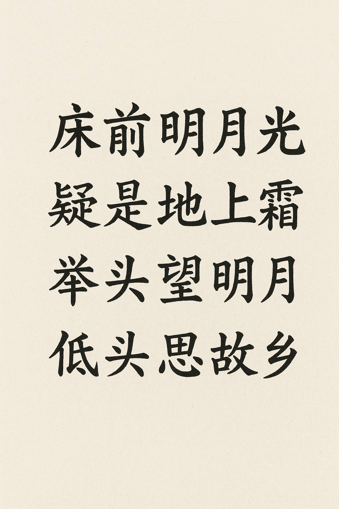

### Tesseract识别效果

通过PIL处理图片，然后使用tesseract识别，效果会好一点  
```json
'text': ['', '', '', '', '床', '前', '明月', '光', '', '疑', '是', '地', '上', '霜', '', '汪汪', '明月', '', '低头', '思', '故', '乡']

床前明月光
疑是地上霜
汪汪 明月
低头思故乡

```

命令行调用直接输出  
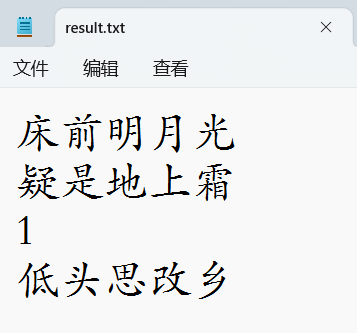


--psm=6 参数调优输出  

```json
'text': ['', '', '', '', '床', '前', '明月', '光', '', '疑', '是', '地', '上', '省', '', '举', '头', '望', '明月', '', '低头', '忌', '故', '乡']


床前明月光
疑是地上省
举头望明月
低头忌故乡

```


### PaddleOCR识别效果

```shell
    "rec_texts": [
        "床前明月光",
        "疑是地上霜",
        "举头望明月",
        "低头思故乡"
    ],

```

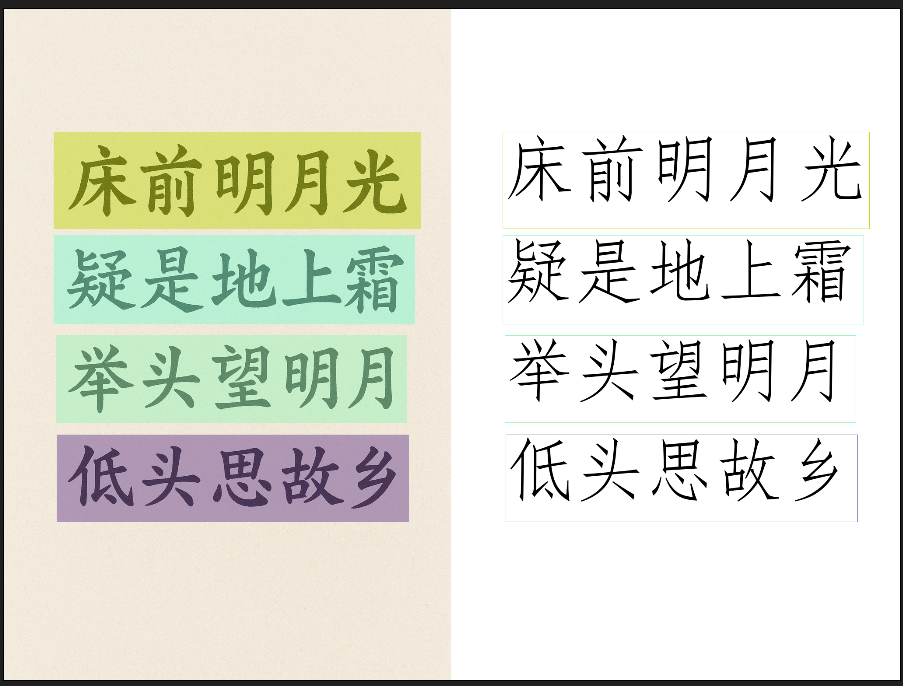


## 2. 复杂古诗识别
  

### Tesseract识别效果
Tesseract传入文件路径直接识别效果不佳   
  
Tesseract传入PIL Image 对象 识别效果好一点  
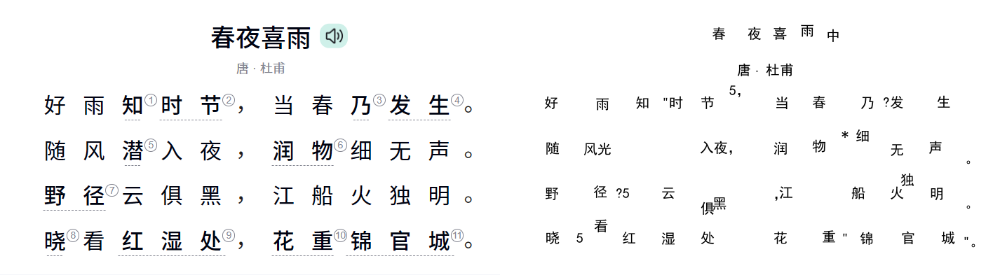  
Tesseract传入PIL Image 对象 开启灰度化  

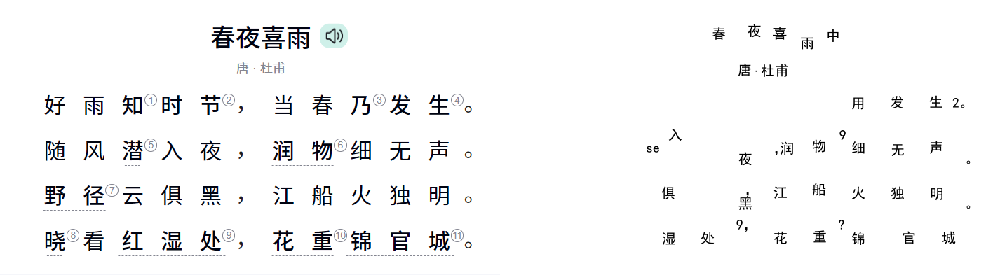  

Tesseract传入PIL Image 对象 开启中值滤波去噪  
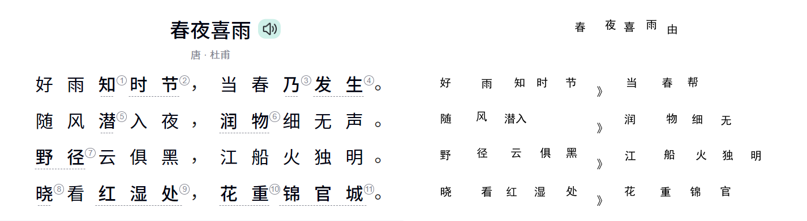  

Tesseract传入PIL Image 对象 开启中值滤波去噪 开启灰度化  
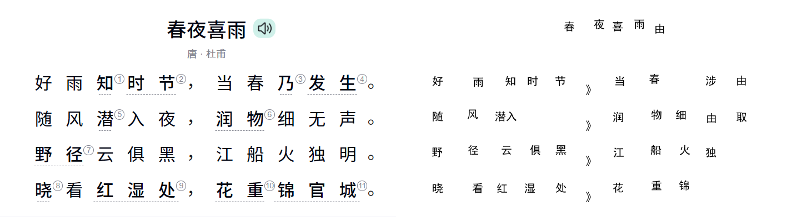  

--psm=6 参数调优输出   


### PP-OCRV5识别效果
``` shell
    "rec_texts": [
        "春夜喜雨 ",
        "唐·杜甫",
        "好雨知时节②，当春乃③发生④。",
        "随风潜入夜，润物细无声",
        "。",
        "野径?云俱黑，",
        "江船火独",
        "明",
        "。",
        "晓看红湿处，花重锦官城。"
    ],
```


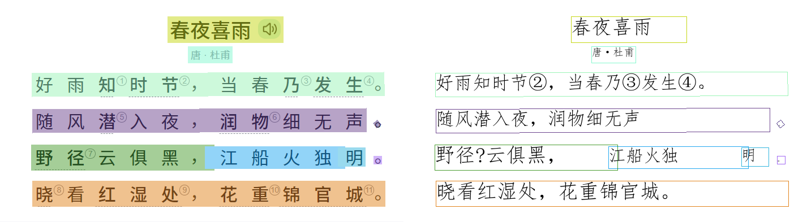

## 3. 手写体识别


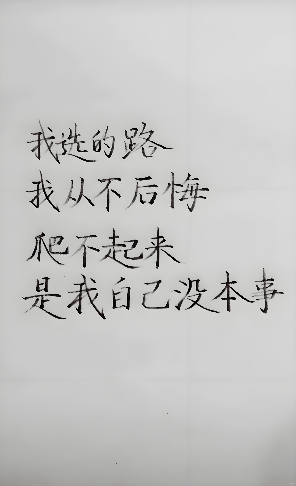

### Tesseract识别效果
该手写体，Tesseract无法识别，识别效果不佳  


### PP-OCRV5识别效果

```shell
    "rec_texts": [
        "我选的路",
        "我从不后悔",
        "爬不起来",
        "是我自己沒本事",
        "百度Ai+"
    ],
```

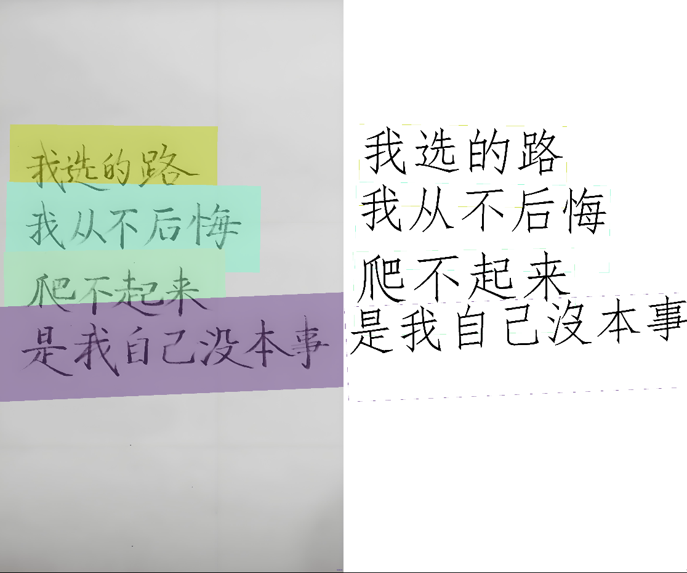


## 4. PDF文件识别（文字版）


### Tesseract识别效果
Tesseract无法直接识别PDF文件，需要先转换为图片，然后再识别  
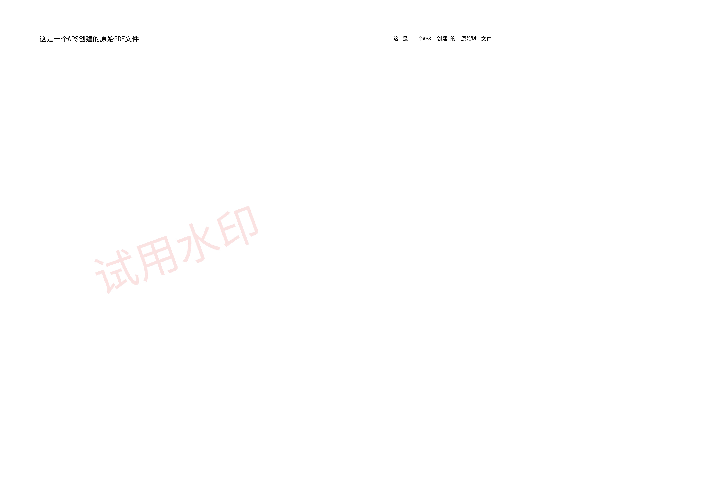
### PP-OCRV5识别效果

```json
    "rec_texts": [
        "这是一个WPS创建的原始PDF文件",
        "试用水印"
    ],

```

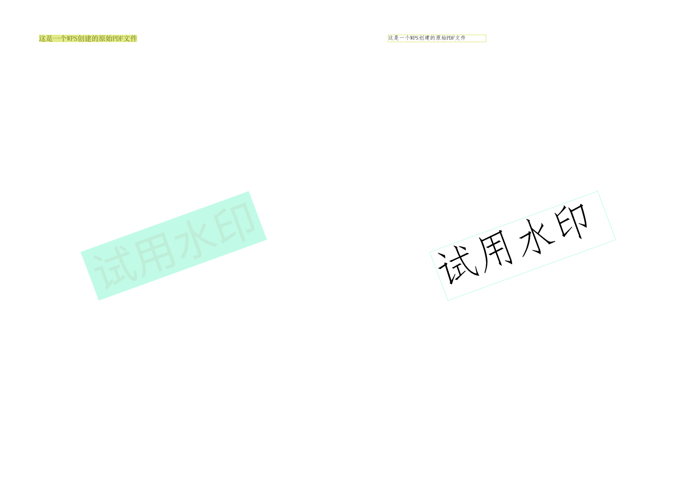


## 5. PDF文件识别（图片版）

### Tesseract识别效果  


开启灰度化和中值滤波去噪后无法识别出有效信息


### PP-OCRV5识别效果  
```json
    "rec_texts": [
        "《泊秦淮》",
        "唐·杜牧",
        "煙籠寒水月籠沙",
        "夜泊秦淮近酒家",
        "商女不知亡國恨",
        "隔江猶唱後庭花",
        "诗词苑"
    ],
```

  

## 5. 中英文混合识别

  


### Tesseract识别效果  

```json
Hello, Worldl!

HTML. C93. JAVASCRIPT
肉蛋堡是一个非常好吃的食物。
```


### PP-OCRV5识别效果  

```json
    "rec_texts": [
        "Hello, World!",
        "HTML. CSS. JAVASCRIPT",
        "肉蛋堡是一个非常好吃的食物。"
    ],
```


## 6. 旋转图片识别


### Tesseract识别效果  


### PP-OCRV5识别效果  

未开启方向自动判断


开启方向自动判断
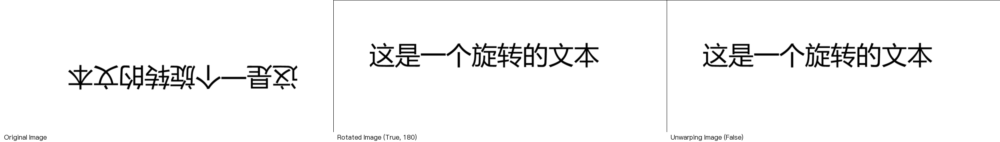


## 7. 背景与文字颜色一致

### Tesseract识别效果  
无法有效识别

### PP-OCRV5识别效果  
无法有效识别


## 8. 背景与文字颜色相似


### Tesseract识别效果  

```
这是一个白色背景+灰色的文字，人类肉眼是很难看到的

```

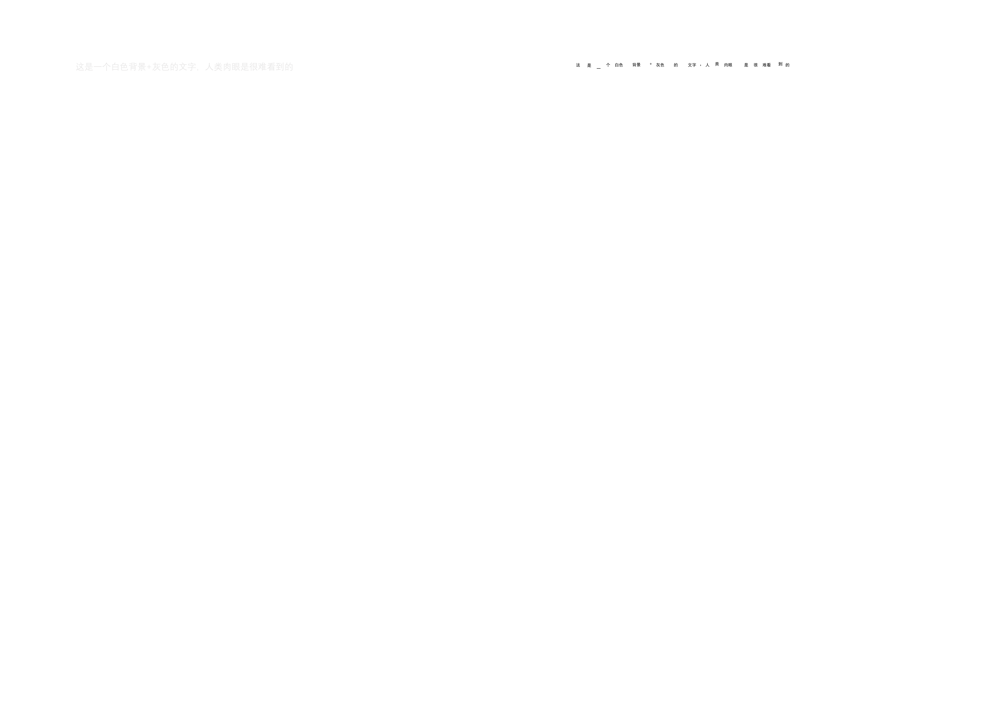

### PP-OCRV5识别效果  

```text
    "rec_texts": [
        "这是一个白色背景+灰色的文字，人类肉眼是很难看到的"
    ],
```
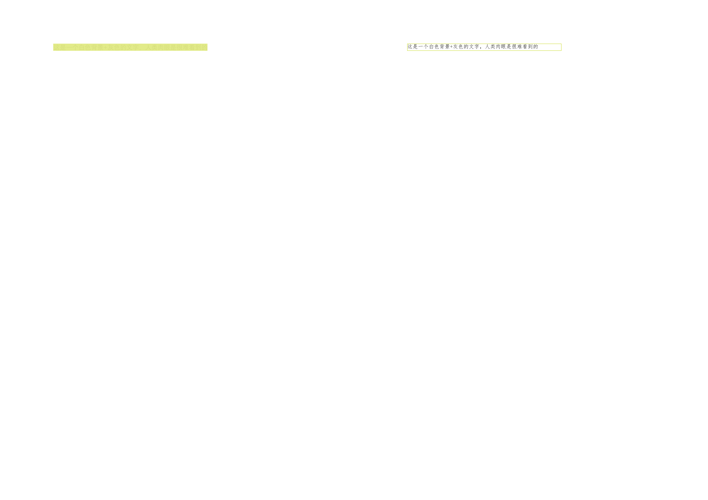


## 横向对比


| 工具/识别类型        |      Tesseract      | PaddleOCR（PP-OCRv5 |
| ------------- | :-----------: | ----: |
| **简单古诗识别**      | 效果不佳      | 效果好 |
| **复杂古诗识别**      | 效果不佳      | 效果好 |
| **手写体识别**      | 效果不佳      | 效果好 |
| **PDF文件识别（文字版）**      | 效果不佳      | 效果好 |
| **PDF文件识别（图片版）**      | 效果不佳      | 效果好 |
| **中英文混合识别**      | 效果不佳      | 效果好 |
| **旋转图片识别**      | 效果不佳      | 效果好 |


| 工具/对比点     |     Tesseract    |    PaddleOCR（PP-OCRv5） |
| ---------- | :--------------: | ---------------------: |
| **资源占用**   |         低        |            高（依赖深度学习框架） |
| **识别效果**   |   传统模型，对杂乱场景敏感   |            现代深度模型，鲁棒性强 |
| **识别稳定性**  |  易受噪声、倾斜、低分辨率影响  |           对复杂背景、变形文本更稳 |
| **识别范围**   |   主要针对印刷体、扫描文档   |      场景文字、文档、表格、数字、多语种 |
| **多语言支持**  |  多语种但质量不均，需要训练数据 |            多模态、多语言效果成熟 |
| **安装成本**   |    低，单可执行文件即可    |   高，需要 PaddlePaddle 环境 |
| **部署环境**   |    轻量，可在极简系统运行   |      对 CPU/GPU 有依赖，体积大 |
| **离线使用**   |    完全离线、无额外依赖    |            完全离线，但框架体积大，需要下载离线模型 |
| **PDF 支持** | 不直接支持 PDF，需要额外转图 |      支持 PDF 直接识别|
| **支持二次训练** | 支持 | 支持 |
| **可执行文件支持** | 官方提供 | PyInstaller 打包|

 