> 本文根据原始教程文档转写，按原教程顺序保留文字与截图，未做发散。

## 概述

FTP 协议服务端搭建的方式包含 IIS, FileZilla等 下述方式仅为Windows10 版本IIS方式。如果已存在搭建好的服务端，可根据现场环境修改FTP协议服务端网络IP，请直接跳转到标题1.3修改IP即可。

## 创建用户

创建一个用户账号用于客户端登录，假设用户名称为ftpuser

右键点击开始图标，选择计算机管理。

点击本地用户和组，选择用户。

右键点击用户，选择新用户

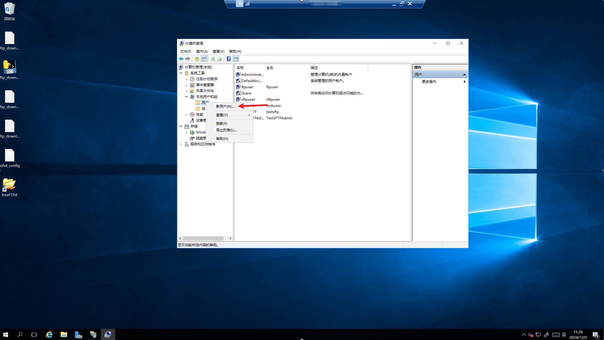

输入用户信息，下方勾选栏选项如图配置，点击创建

Tips：对于家庭版用户可能没有该功能，需要通过其他方式添加用户，参考标题1.4内容

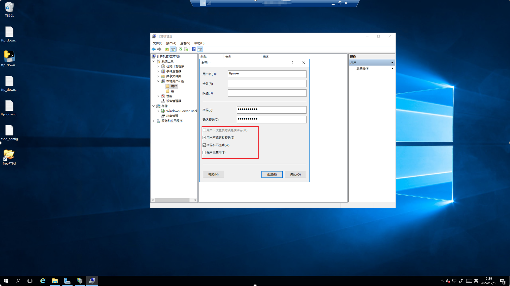

## 搭建 FTP

创建完毕后，在系统左下角点击搜索栏或者通过快捷键Win+S打开搜索栏，搜索关键字“IIS管理器”，根据提示打开Internet Information Services(IIS)管理器。

进入IIS管理器后，依次点击点开左侧视图列表，随后右键单击“网站“，选择添加FTP站点。

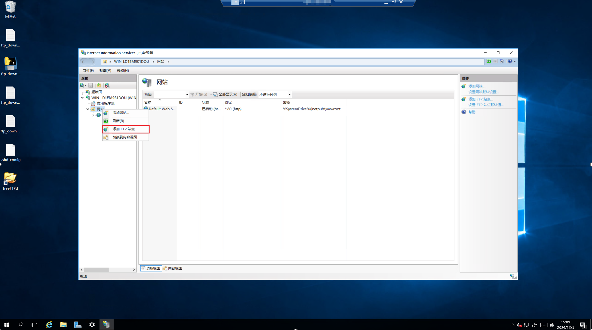

输入必要信息，站点名称和物理路径，点击下一步。

Tips: 站点名称作为名称标识，可以随意修改，物理路径作为FTP服务端的根目录，即登录后的目录。假设配置得物理路径为D:\ftp, 其下有子目录D:\ftp\test, 客户端使用时输入/test即可。

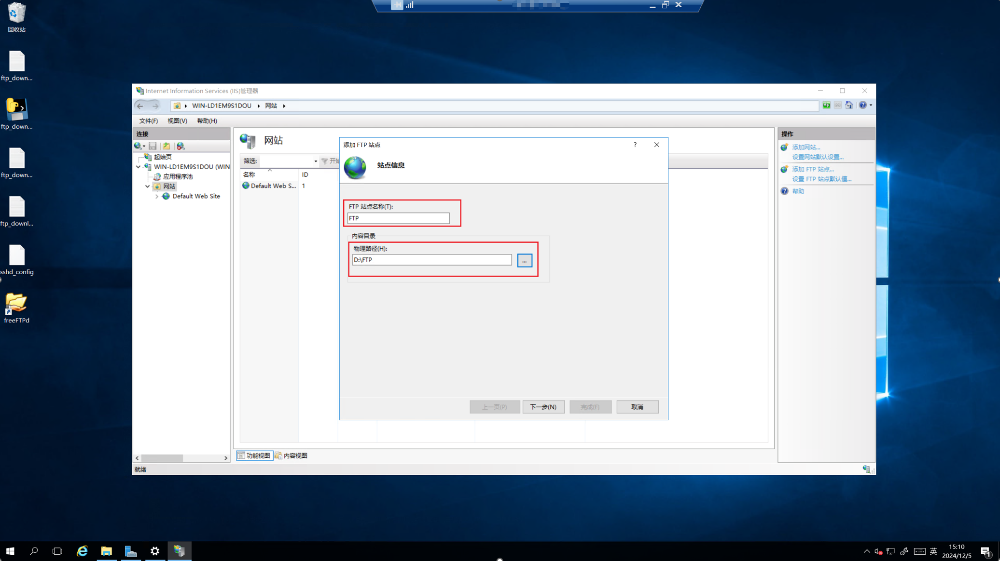

进行绑定IP、端口设置，IP地址选择本机IP，端口默认21，不启用虚拟主机名，关闭SSL证书，开启自动启动FTP站点，点击下一步。

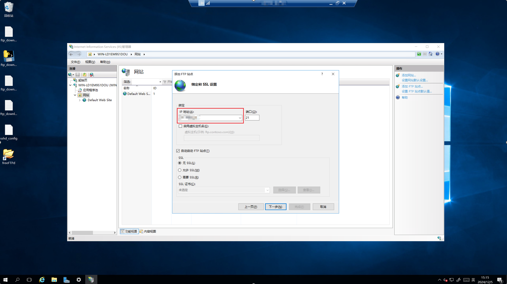

进行身份验证配置，开启基本身份验证，关闭匿名登录，授权给指定用户访问，下方输入对应步骤1中的用户名，权限配置为允许读取和写入，点击完成。

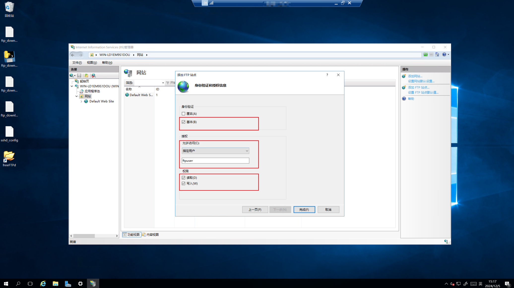

## 已存在服务端，修改网络 IP

对于已存在服务端，根据现场网络环境修改IP即可，可通过以下步骤实现

打开“IIS管理器”，找到已存在的FTP站点，右键单击，选择编辑绑定

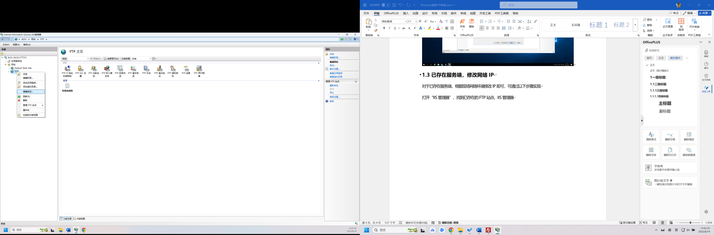

在弹出的对话框中，双击IP地址，修改为对应的IP即可，点击确定进行保存。

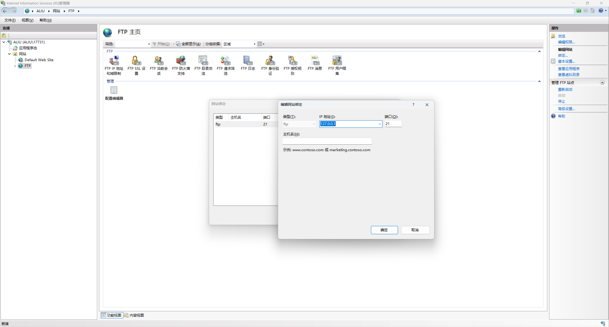

修改IP完毕后需要对FTP站点进行重启，右键单击站点，选择管理FTP站点-重新启动。

## 家庭版系统添加用户

可通过命令工具打开创建菜单。按 Win+R 输入 netplwiz → 点击「添加」→ 选择「不使用 Microsoft 账户登录」→ 选择「本地账户」→输入用户名和密码完成本地账户创建。

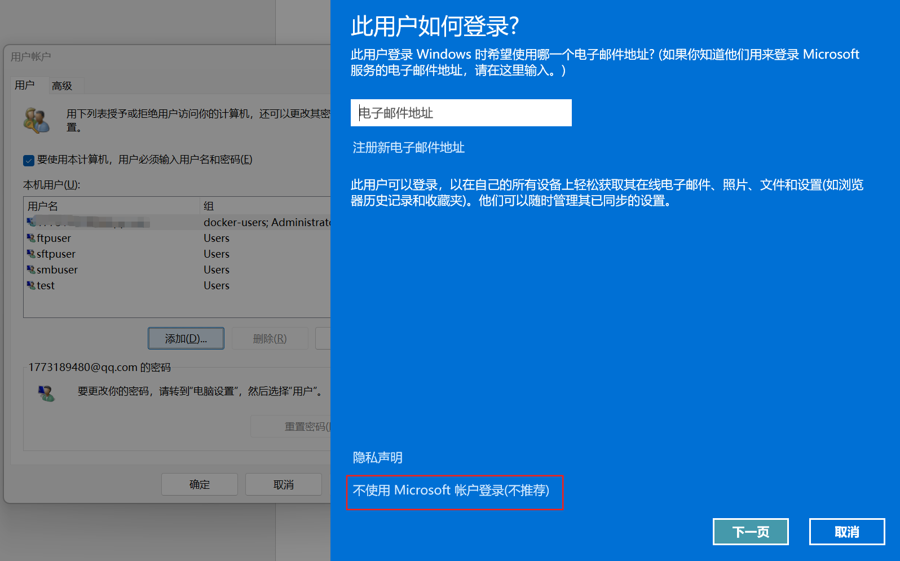

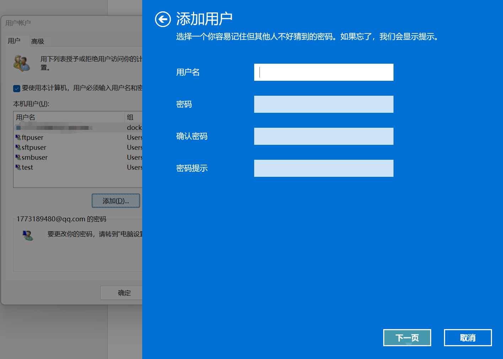

## 启动或关闭 Windows 功能

Win+S键搜索控制面板，打开顺序【控制面板-程序和功能-启动或关闭Windows功能】，在弹出的窗口中选择以下选项：

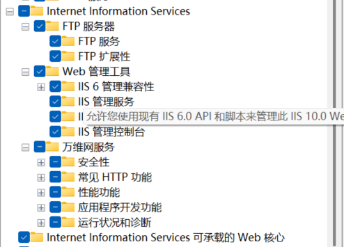

点击确认，然后重启电脑即可搜索到IIS管理器
