> 本文根据原始教程文档转写，按原教程顺序保留文字与截图，未做发散。
> 其中 FTP（IIS）与 OpenSSH-SFTP 部分与站内已有《FTP协议》《sftp》文章存在重叠，本汇总文档新增内容为 mini-sftp-server、S3（MinIO）、SMB。

## FTP 协议（Windows Server 2016 IIS）

FTP 协议服务端搭建的方式包含 IIS、FileZilla 等，下述方式仅为 WindowsServer 2016 版本 IIS 方式，如有其他系统版本 IIS，操作方式类似。

创建一个 ftpuser 用户用于客户端登录。

右键点击开始图标，选择计算机管理。

点击本地用户和组，选择用户。

右键点击用户，选择新用户。

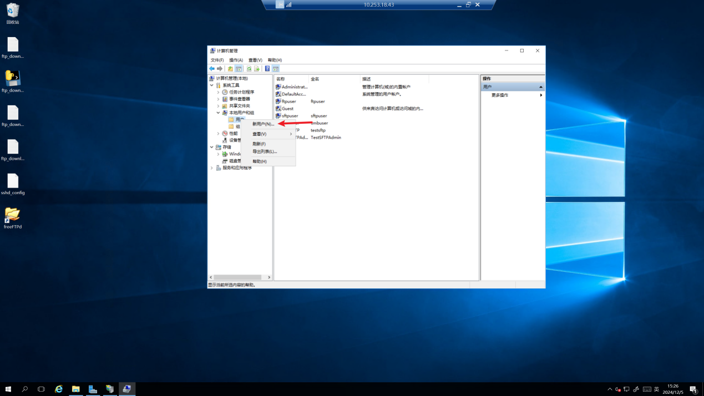

输入用户信息，下方勾选栏选项如图配置，点击创建。

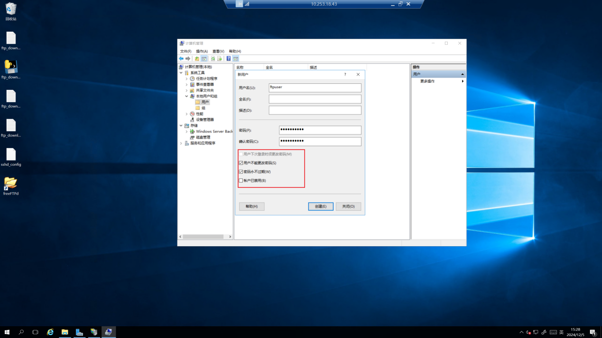

进入系统搜索“服务器管理器”，然后打开，（其他 Windows 版本搜索 IIS 管理器即可）。

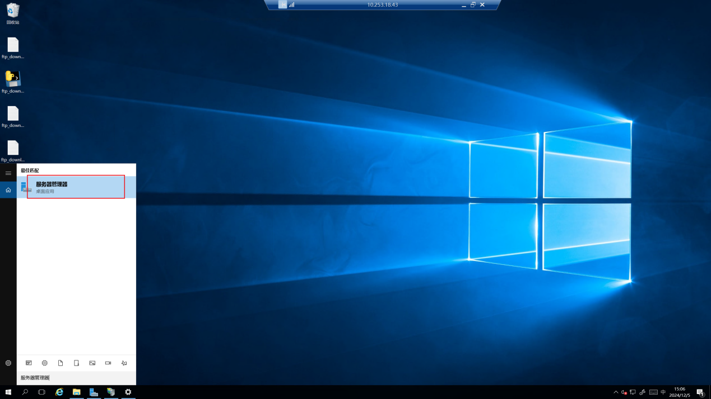

进入“服务器管理器”页面，点击右上角的工具，选择“IIS 管理器”，其他版本例如 Windows10 可直接在系统左下角点击搜索栏或者通过快捷键 Win+S 打开搜索栏，搜索关键字“IIS 管理器”，根据提示打开 Internet Information Services (IIS) 管理器。

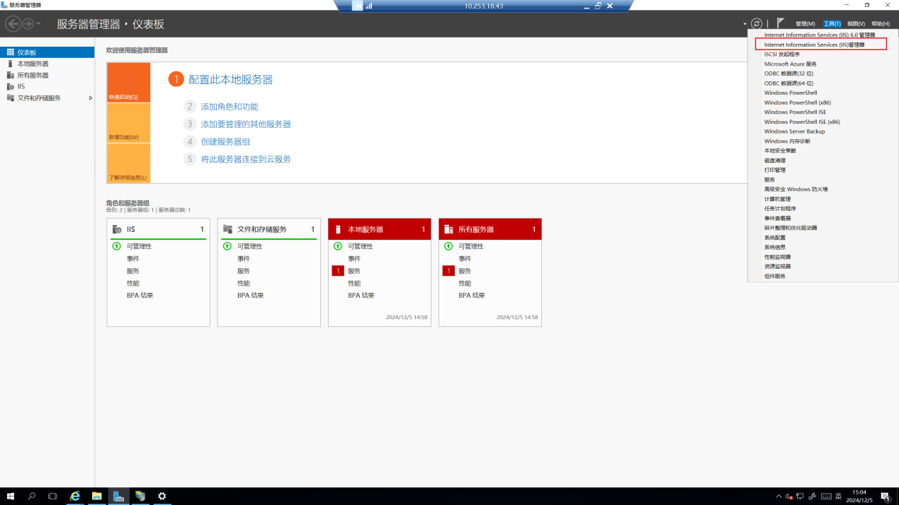

进入 IIS 管理器后，依次点击点开左侧视图列表，随后右键单击“网站”，选择添加 FTP 站点。

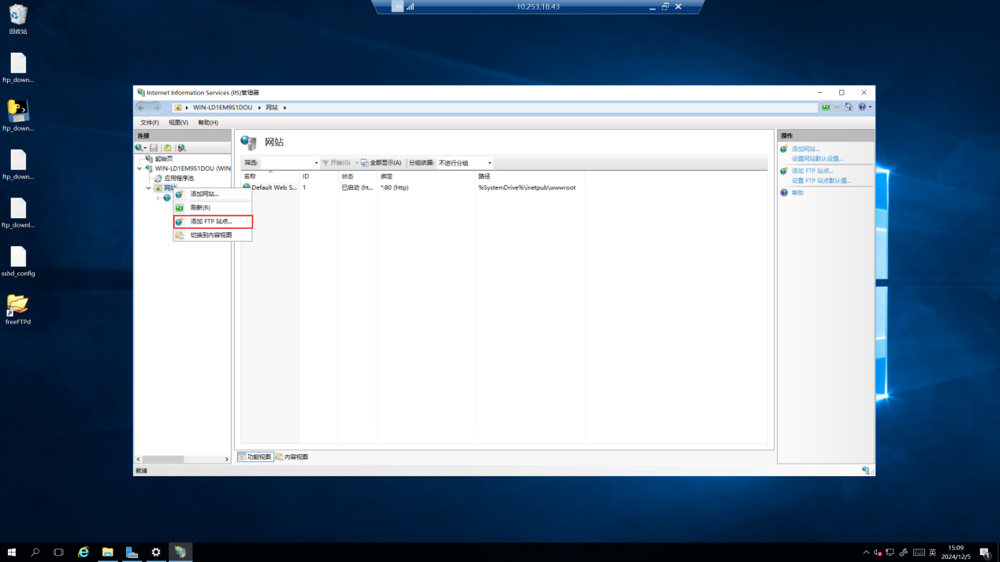

输入必要信息，站点名称和物理路径，点击下一步。

Tips: 站点名称作为名称标识，可以随意修改。

物理路径作为 FTP 服务端的根目录，即登录后的目录。


进行绑定 IP、端口设置，IP 地址选择本机 IP，端口默认 21，不启用虚拟主机名，关闭 SSL 证书，开启自动启动 FTP 站点，点击下一步。

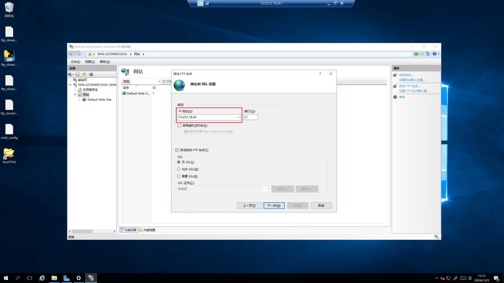

进行身份验证配置，开启基本身份验证，关闭匿名登录，授权给指定用户访问，下方输入对应步骤 1 中的用户名，权限配置为允许读取和写入，点击完成。

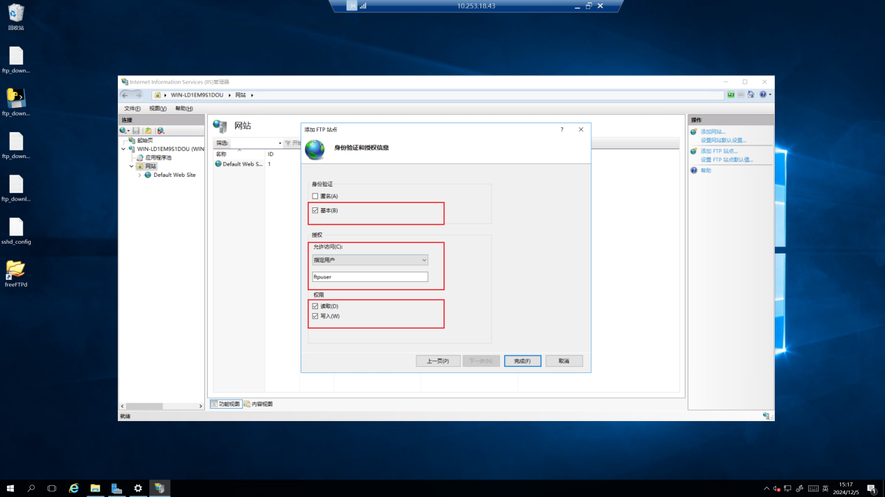

## SFTP 协议

### 2.1 mini-sftp-server

单击运行桌面可执行程序 mini-sftp-server.exe。

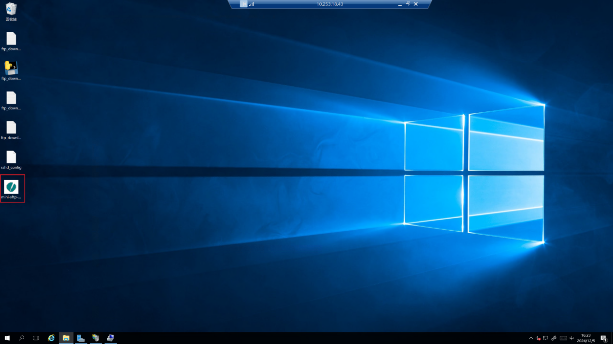

输入必要信息，点击 Options 配置说明如下，配置完成后，点击 OK。

User: sftp 用户名

Password: 密码

Port: 端口

Root path: 访问后的根目录

Enable zlib 是否允许客户端开启压缩

Enable nagle 是否允许客户端启用 nagle 算法

Enable scp 允许使用客户端使用 scp

FIPS mode 切换 FIPS 模式

List hidden files 列出隐藏的文件

UTF-8 编码支持中文

IP/Address 服务端暴露可访问的 IP

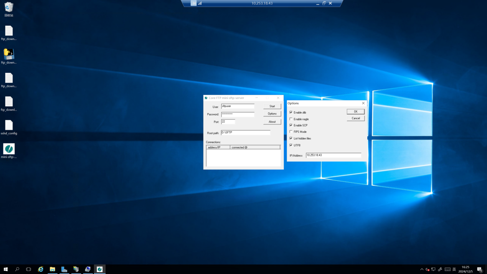

点击 start 启动。

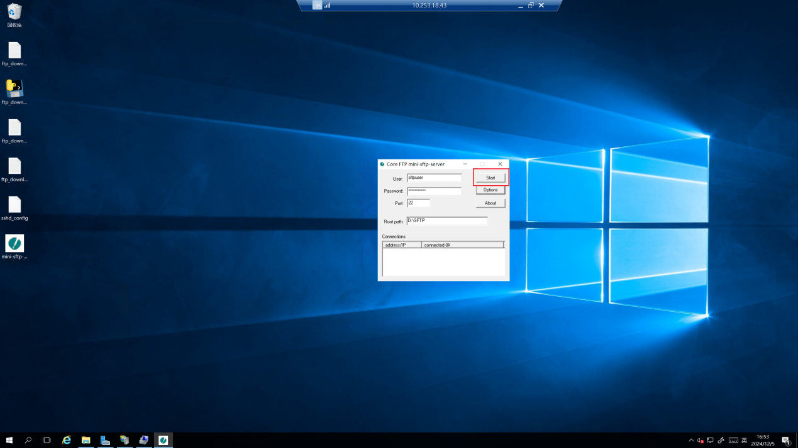

### OpenSSH

安装之前，把之前的都卸载干净。

1. 把下载好的 OpenSSH-Win64.zip 文件解压，把 OpenSSH 整个目录复制到 `C:\Program Files`（避免未知错误）。
2. 把 `C:\Program Files\OpenSSH-Win64` 添加到环境变量。
3. 管理员启动 cmd，进入到 `C:\Program Files\OpenSSH-Win64`，执行如下命令：

```shell
powershell.exe -ExecutionPolicy Bypass -File install-sshd.ps1
```

开放 22 端口：

```shell
netsh advfirewall firewall add rule name=sshd dir=in action=allow protocol=TCP localport=22
```

配置开机自启服务：

```shell
sc config sshd start= auto
```

开启服务：

```shell
net start sshd
```

替换配置文件，位置 `C:\ProgramData\ssh\sshd_config`。

## S3 协议（MinIO）

使用 minio 提供 S3 协议的服务端。

桌面点击 S3 目录，单击 `start-s3-server.bat` 执行启动。

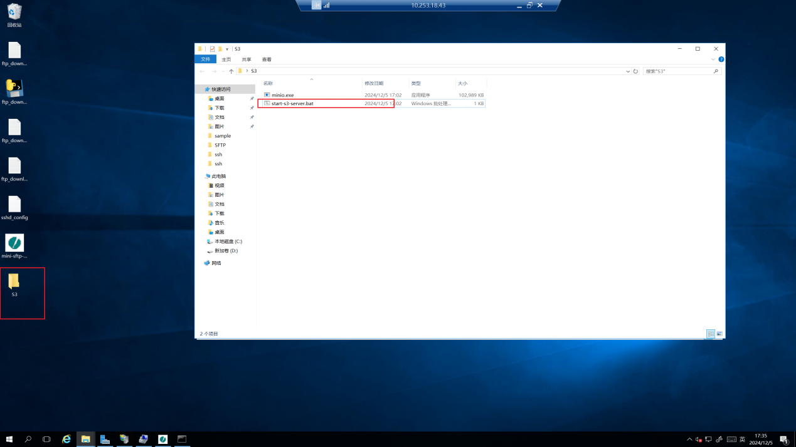

可通过如下所示的地址进行访问，默认的账户和密码均为 `minioadmin`。

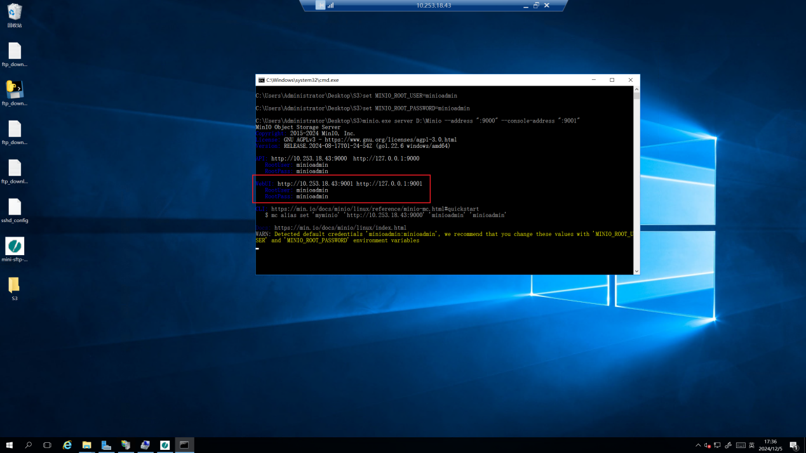

打开浏览器输入访问 url，依次单击左侧导航栏 Identity → Users，然后单击右侧 Create User+，进行用户创建。

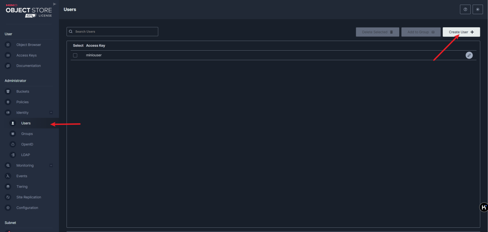

输入创建的用户信息，勾选下方用户策略，点击 Save。

ConsoleAdmin : 允许用户完全访问 MinIO 控制台

Diagnostics 允许用户执行诊断操作，例如获取服务器的状态和性能信息

Readonly: 允许用户读取存储桶中的所有对象，但不能进行修改

Writeonly: 允许用户向存储桶中写入对象，但不能读取或列出对象

readwrite: 允许用户对存储桶中的所有对象执行读写操作

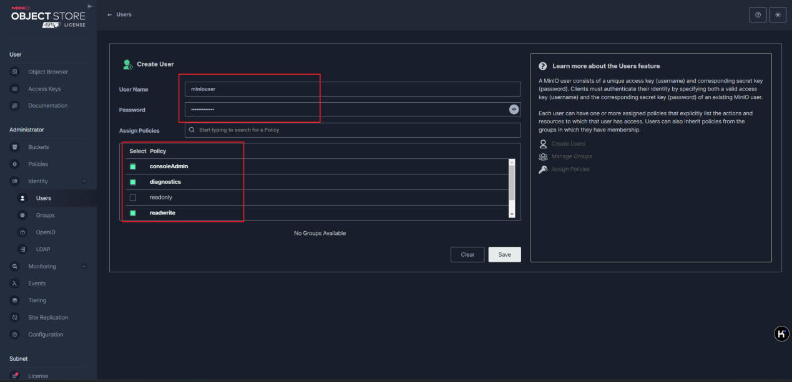

保存完成后，客户端可使用该用户进行操作。

## SMB 协议

依照 FTP 协议创建用户的流程，同样创建一个 smb 用户用于客户端登录。

在空闲磁盘中创建一个目录作为 smb 共享的根目录。

搜索服务器管理器，并进入。

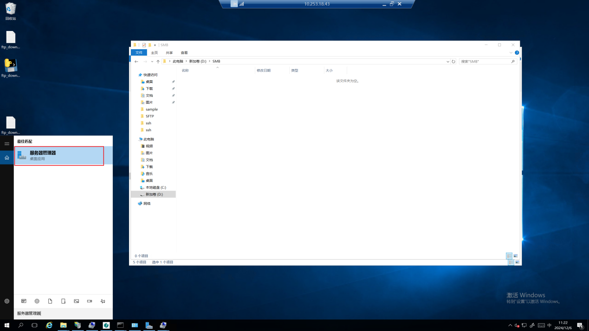

进入后点击右上角工具，选择计算机管理，其他系统版本可直接 win+s 搜索计算机管理。

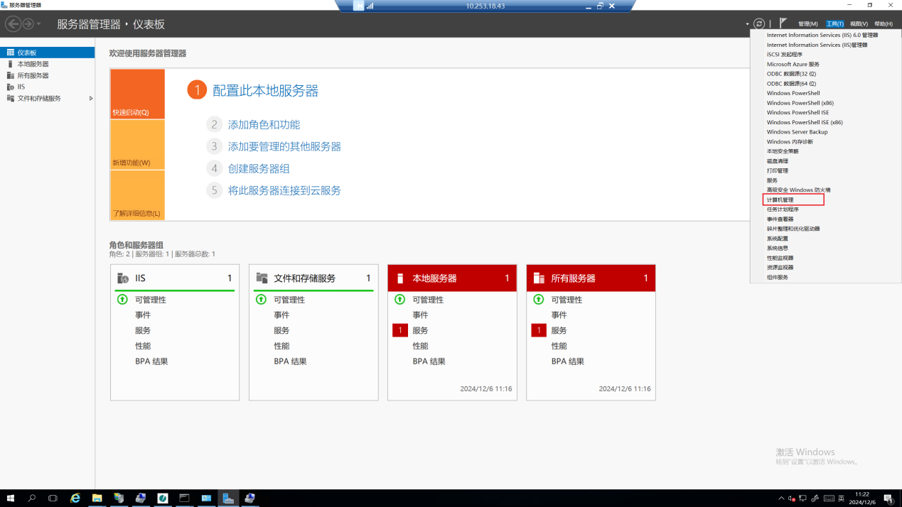

依次点击计算机管理左侧导航栏的共享文件 > 共享，右键单击右侧空白处选择新建共享。

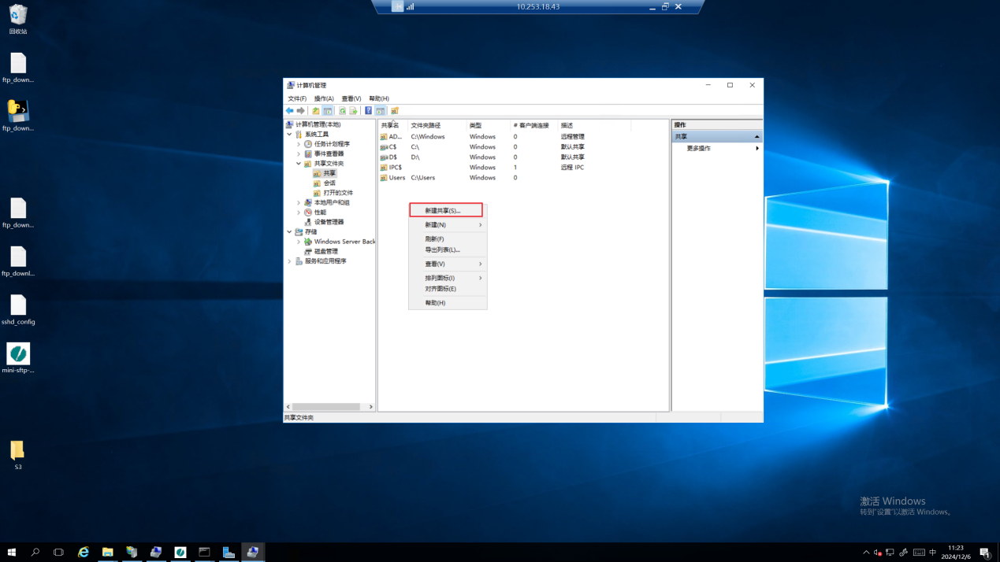

进入创建共享文件夹向导，点击下一步。

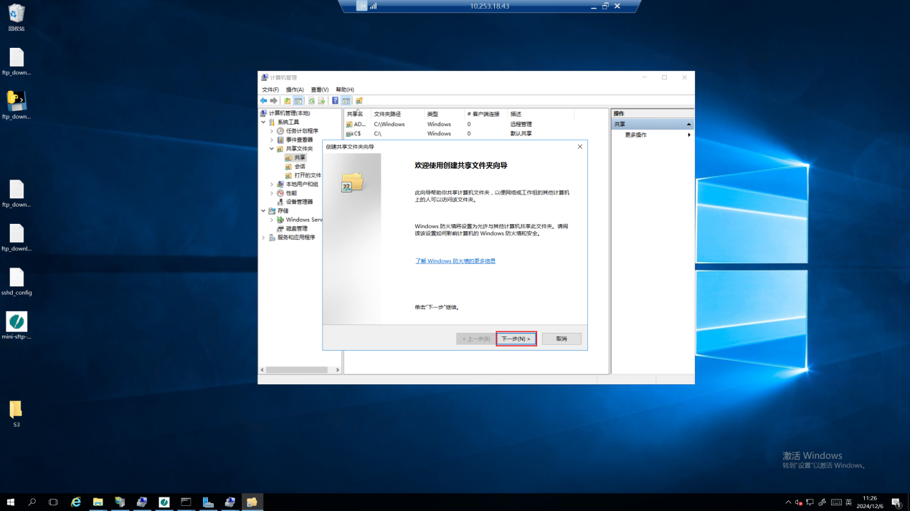

文件夹路径选择刚才新建的目录，点击下一步。


配置共享名，点击下一步。

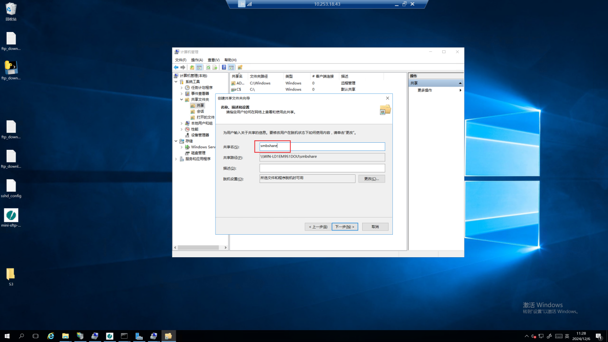

配置共享文件夹权限，进行自定义权限配置，点击添加刚才创建的用户，赋予权限。

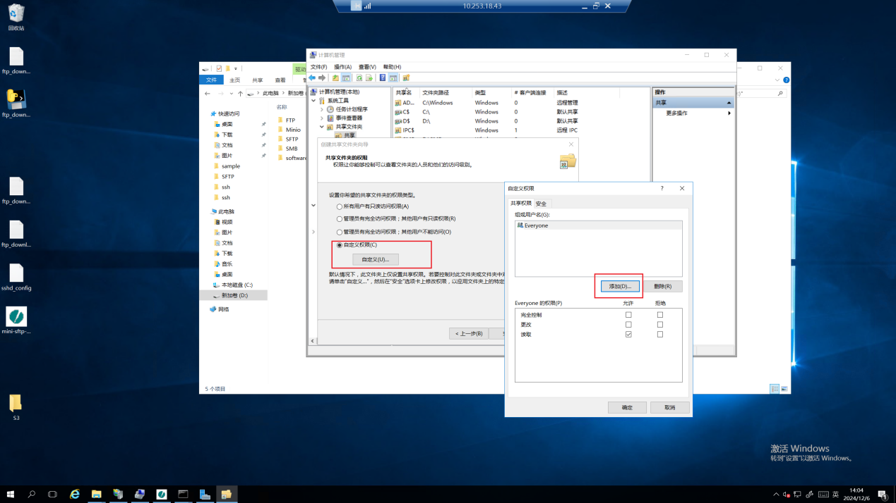

点击添加后弹出选择用户或组，点击高级。


点击立即查找，在下方搜索结果中选择刚才创建的用户，点击确定。

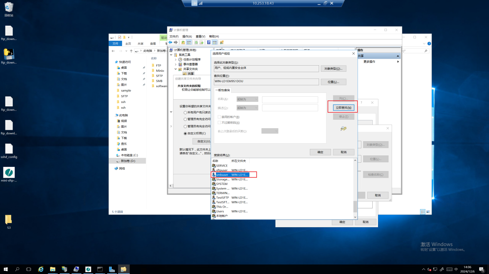

返回后，可以看到对象名称后，继续点击确定按钮。


赋予用户完全控制权限。


同时删除掉 Everyone 的权限，只留下所选用户，这样其他用户就无法通过远程连接方式访问共享目录。

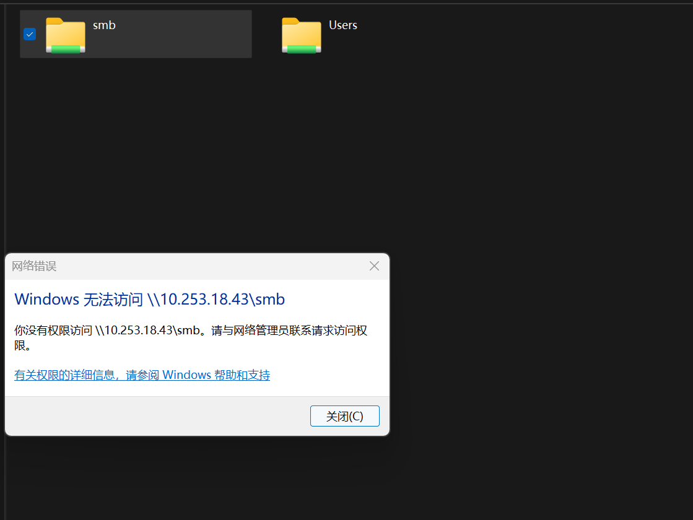
