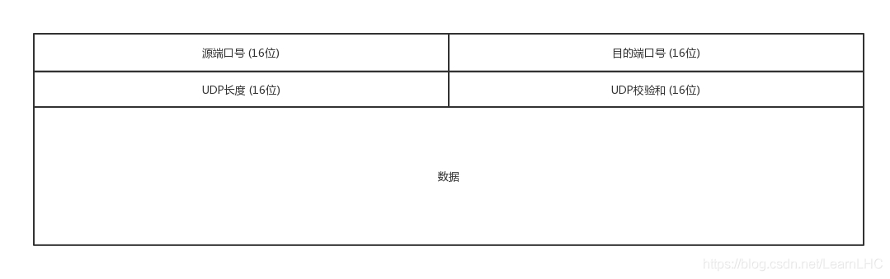

# UDP 协议简介

小刘，我们从工程视角来聊一聊 UDP（User Datagram Protocol），它在网络世界里是一个**简单、直接、速度优先**的角色。

UDP 位于 **OSI 第四层（传输层）**，与 TCP 同级，但设计哲学几乎相反：
TCP 追求“可靠、完整、有序”，UDP 追求“快、轻、少约束”。



---

## 一、UDP 是什么

UDP 是一种**无连接的传输层协议**。
“无连接”不是说不能通信，而是通信前**不建立连接、不维护状态**。

换句话说，UDP 更像是“寄信”：
- 写好内容
- 塞进信封
- 投递出去
- 至于对方是否收到、什么时候收到、顺序是否正确 —— 不关心

---

## 二、UDP 的核心特征

### 1. 无连接
UDP 不需要三次握手，也没有连接建立和释放过程。只要知道对方 IP 和端口，就可以直接发送数据。
这意味着：启动快、延迟低、协议状态极少。

### 2. 不保证可靠性
UDP **不保证**：数据一定到达、只到达一次、按顺序到达。
协议本身不重传、不确认（ACK）、不做流量控制、不做拥塞控制。可靠性完全交给**上层应用**处理。

### 3. 面向报文
UDP 是**面向报文（message-oriented）**的协议。发送端发一个 datagram，接收端要么完整收到、要么直接丢弃，**不存在 TCP 那种「半包 / 粘包」语义**。

### 4. 协议头部极小
UDP 头部固定只有 **8 字节**（TCP 首部至少 20 字节），无连接状态、处理简单、传输效率高。

| 字段 | 长度 | 说明 |
|------|------|------|
| 源端口（Source Port） | 16 位 | 发送方端口号，**可选**。不需要对方回信时可填 0 |
| 目的端口（Destination Port） | 16 位 | 接收方端口号，**必填** |
| 长度（Length） | 16 位 | UDP 数据报总长度（首部 8 + 数据），最小为 8 |
| 检验和（Checksum） | 16 位 | **可选**（IPv4）；IPv6 下强制计算 |

---

## 三、UDP 报文格式

UDP 数据报由**首部**和**数据**组成，首部固定 8 字节：

```
 0               1               2               3
 0 1 2 3 4 5 6 7 0 1 2 3 4 5 6 7 0 1 2 3 4 5 6 7 0 1 2 3 4 5 6 7
+-+-+-+-+-+-+-+-+-+-+-+-+-+-+-+-+-+-+-+-+-+-+-+-+-+-+-+-+-+-+-+-+
|          源端口号            |          目的端口号            |
+-+-+-+-+-+-+-+-+-+-+-+-+-+-+-+-+-+-+-+-+-+-+-+-+-+-+-+-+-+-+-+-+
|            长度              |          检验和                |
+-+-+-+-+-+-+-+-+-+-+-+-+-+-+-+-+-+-+-+-+-+-+-+-+-+-+-+-+-+-+-+-+
|                            数据 ...                          |
+-+-+-+-+-+-+-+-+-+-+-+-+-+-+-+-+-+-+-+-+-+-+-+-+-+-+-+-+-+-+-+-+
```

与 TCP 不同，UDP 首部**没有「序号」「确认号」「窗口」「标志位」**，因此非常简单。

---

## 四、校验和与伪首部

UDP 的检验和采用与 TCP 相同的**二进制反码求和**算法。IPv4 下字段为 0 表示未计算；**IPv6 下校验和强制必须计算**。

计算时除了 UDP 首部和数据，还会拼上一个**伪首部（Pseudo Header）**。伪首部**并不真实传输**，仅用于校验，目的是让 UDP 能校验「数据报是否送到了正确的主机和协议」：

```
 0               1               2               3
 0 1 2 3 4 5 6 7 0 1 2 3 4 5 6 7 0 1 2 3 4 5 6 7 0 1 2 3 4 5 6 7
+-+-+-+-+-+-+-+-+-+-+-+-+-+-+-+-+-+-+-+-+-+-+-+-+-+-+-+-+-+-+-+-+
|                      32 位源 IP 地址                         |
+-+-+-+-+-+-+-+-+-+-+-+-+-+-+-+-+-+-+-+-+-+-+-+-+-+-+-+-+-+-+-+-+
|                     32 位目的 IP 地址                       |
+-+-+-+-+-+-+-+-+-+-+-+-+-+-+-+-+-+-+-+-+-+-+-+-+-+-+-+-+-+-+-+-+
| 保留(0) | 协议(17) |            UDP 长度                     |
+-+-+-+-+-+-+-+-+-+-+-+-+-+-+-+-+-+-+-+-+-+-+-+-+-+-+-+-+-+-+-+-+
```

- 协议号 **17** 表示 UDP（TCP 为 6），用于确认上层协议身份。
- 接收方校验和出错时，UDP 直接**丢弃该数据报**，不发送任何差错通知（再次体现「不可靠」）。
- 发送方未计算校验和（字段为 0）时，接收方**不会**因字段为 0 而丢弃，而是跳过校验。

---

## 五、UDP 为什么是不可靠的

UDP 之所以「不可靠」，是因为它在协议层面**刻意不做**以下事情：

- **无确认机制**：发出后不等待确认，也无从得知对方是否收到。
- **无重传机制**：丢失、重复、乱序时不重发、不纠正。
- **无流量控制**：不考虑接收方缓冲区是否溢出。
- **无拥塞控制**：网络拥塞时仍按原速率发送，可能雪上加霜。

这些「缺失」并非缺陷，而是**设计取舍**：换来了极低的首部开销和最低延迟。可靠性如果需要，就由**应用层协议**自己实现。

---

## 六、优势与劣势

**优势**（从系统/性能角度）：
1. **低延迟**：无连接、无确认、无重传等待。
2. **低开销**：协议头小、状态管理少、内核负担轻。
3. **可控性强**：应用层可自定义重传、顺序、拥塞控制、加密与校验。

**劣势**：
- 丢包、乱序、重复包是常态。
- 网络拥塞时不「自我约束」。
- 因此**不适合**：文件传输（直接用）、强一致性数据同步、对可靠性极端敏感的场景。

---

## 七、适用场景与典型应用协议

UDP 特别适合「**可以容忍少量丢失，但不能接受高延迟**」的场景：

| 场景 | 原因 |
|------|------|
| 实时音视频（直播、通话、会议） | 容忍少量丢包，但无法容忍重传带来的几百毫秒延迟 |
| 实时游戏 / 多人竞技 | 延迟敏感，丢包比卡顿更可接受 |
| 广播 / 组播 | TCP 是点对点连接，UDP 天然支持一对多 |
| 海量小请求（DNS、DHCP 查询） | 一次请求一次响应，建连开销不划算 |
| 高速内网传输（TFTP、数据库同步） | 链路质量好，可靠性由应用保证更高效 |
| 需要自定义可靠性的场景 | 应用层可实现比 TCP 更贴合业务的可靠机制（QUIC、KCP） |

基于 UDP 的典型应用协议：
- **DNS**：通常基于 UDP 53，一次查询一次响应，超时后才可能走 TCP。
- **DHCP**：客户端初始没有 IP，无法建 TCP 连接，只能用广播 UDP。
- **TFTP / SNMP / RIP / RTP·RTCP**：轻量文件传输、网管、路由、音视频流媒体载体。
- **QUIC（HTTP/3 的底层）**：在 UDP 之上实现可靠、有序、0-RTT、拥塞控制。

---

## 八、UDP 上如何实现「可靠传输」

当应用确实需要可靠，又想保留 UDP 的低延迟/灵活性时，常见做法是在**应用层自己做可靠性**：

- **QUIC（HTTP/3）**：Google 提出，现为标准。在 UDP 之上实现可靠有序、0-RTT/1-RTT 建连、多路复用且无队头阻塞、连接迁移。
- **KCP**：以牺牲带宽换低延迟的可靠 UDP 方案，广泛用于游戏、弱网传输。
- **WebRTC / SRTP**：媒体数据走 UDP（RTP/SRTP），丢包时通过前向纠错（FEC）、丢帧而非重传来保证流畅。
- **自研可靠 UDP**：游戏、IM 常基于 UDP 自研序号、确认、超时重传、拥塞控制的子集，做到「刚好可靠」。

---

## 九、UDP 与 TCP 对比

| 特性 | TCP | UDP |
|------|-----|-----|
| 连接性 | 面向连接（三次握手、四次挥手） | 无连接 |
| 可靠性 | 可靠（确认、重传、序号） | 不可靠（尽最大努力交付） |
| 顺序性 | 保证按序到达 | 不保证顺序 |
| 数据边界 | 字节流，无消息边界（可能粘包/拆包） | 保留报文边界（面向报文） |
| 速度 | 较慢（握手、确认、控制开销） | 较快 |
| 首部开销 | 20~60 字节 | 8 字节 |
| 流量控制 | 有（滑动窗口） | 无 |
| 拥塞控制 | 有（慢启动、拥塞避免等） | 无 |
| 通信模式 | 仅一对一 | 一对一、一对多、多对多、广播/组播 |
| 适用场景 | 文件传输、网页、邮件 | 音视频、DNS、游戏、实时通信 |

---

## 十、常见问题

**Q1：UDP 会粘包/拆包吗？**
不会。UDP 是「面向报文」的，保留应用层交付的报文边界：一次 `sendto` 对应一次 `recvfrom`，不会合并也不会拆分。所谓「UDP 粘包」通常是应用层把多个逻辑消息塞进了一个数据报。

**Q2：UDP 最大能发多大？**
长度字段 16 位，最大 65535 字节，减 8 字节首部，单包数据最大 **65527 字节**。但受 **MTU**（以太网通常 1500）限制，超过会在 IP 层分片，任一片丢失整包作废，因此**实际建议控制在 1472 字节（1500 - 20 IP - 8 UDP）以内**避免分片。

**Q3：UDP 不是不可靠吗，为什么 DNS 用 UDP？**
DNS 查询通常一次请求一次响应，数据量小、对延迟敏感；用 TCP 多一次握手往返代价过高。DNS 在响应超时会改用 TCP，重要区传输（AXFR）本就走 TCP——「默认 UDP 追求快，必要时退化到 TCP 保证可靠」。

**Q4：如何对 UDP 做「限流/防拥塞」？**
UDP 自身没有拥塞控制，大量使用（自研可靠 UDP、QUIC、视频推流）需在**应用层**实现拥塞控制（如 QUIC 自带 BBR-like 算法、KCP 流控），否则容易把网络打满。

---

## 十一、工程实践中的一句话总结

小刘，如果用一句工程化的话来总结 UDP：

> UDP 提供的是“传输能力”，而不是“传输保证”。

是否可靠、是否有序、是否安全，完全取决于你在应用层愿意付出多少设计成本。当你追求极致性能、低延迟、强可控性时，UDP 往往是那个值得认真对待的底座协议。
