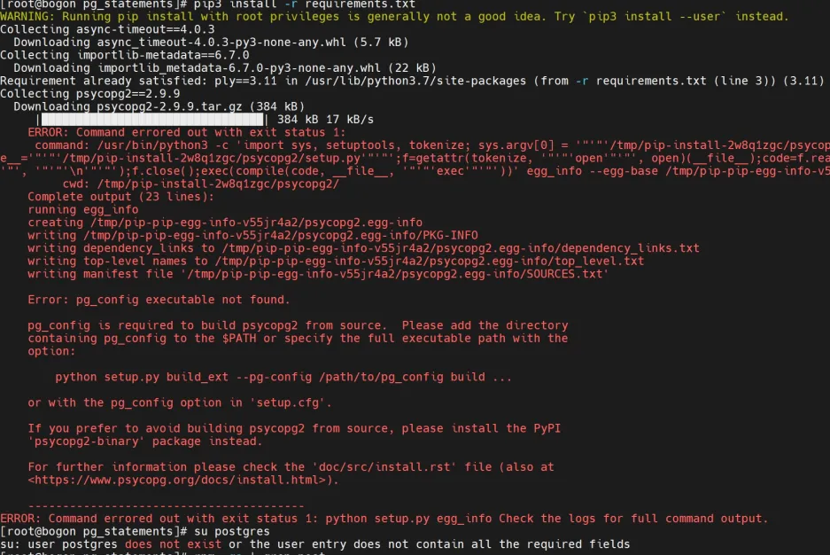

# psycog2
当前操作系统 red-hat系   国产浪潮NF218M3 银河麒麟v10操作系统  
未安装情况下报错提示：

安装python依赖包psycopg之前，你必须需要先安装postgresql数据库的相关组件：  
`postgresql-devel`  
`postgresql`  
`postgresql-libs`  
这三个组件比较重要。另外，可选组件：postgresql-server
通过以下命令检查是否安装了相关组件  
`rpm -qa | grep postgresql`  
安装所需依赖父级包  
`yum install postgresql-devel`   
